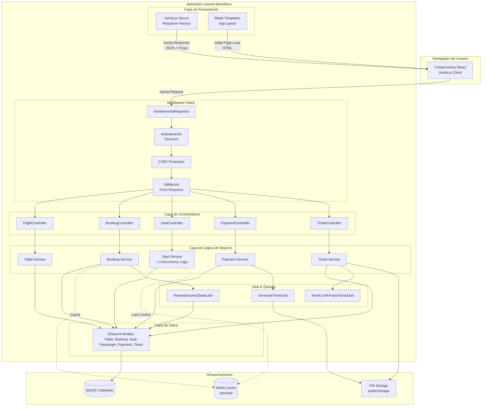
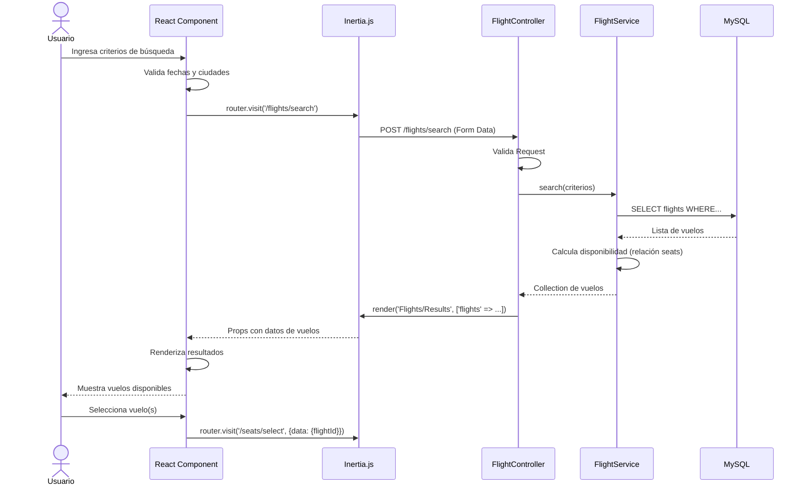
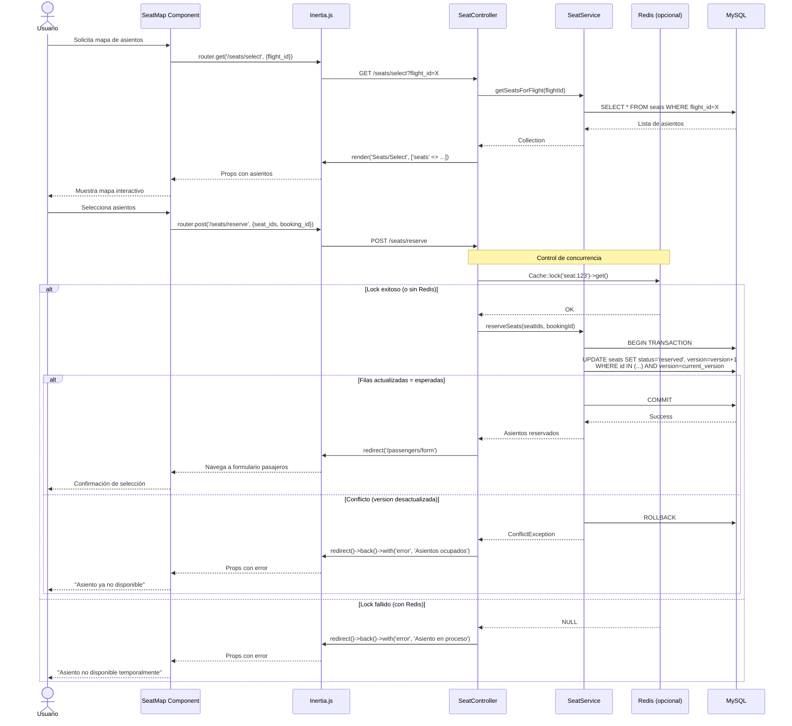
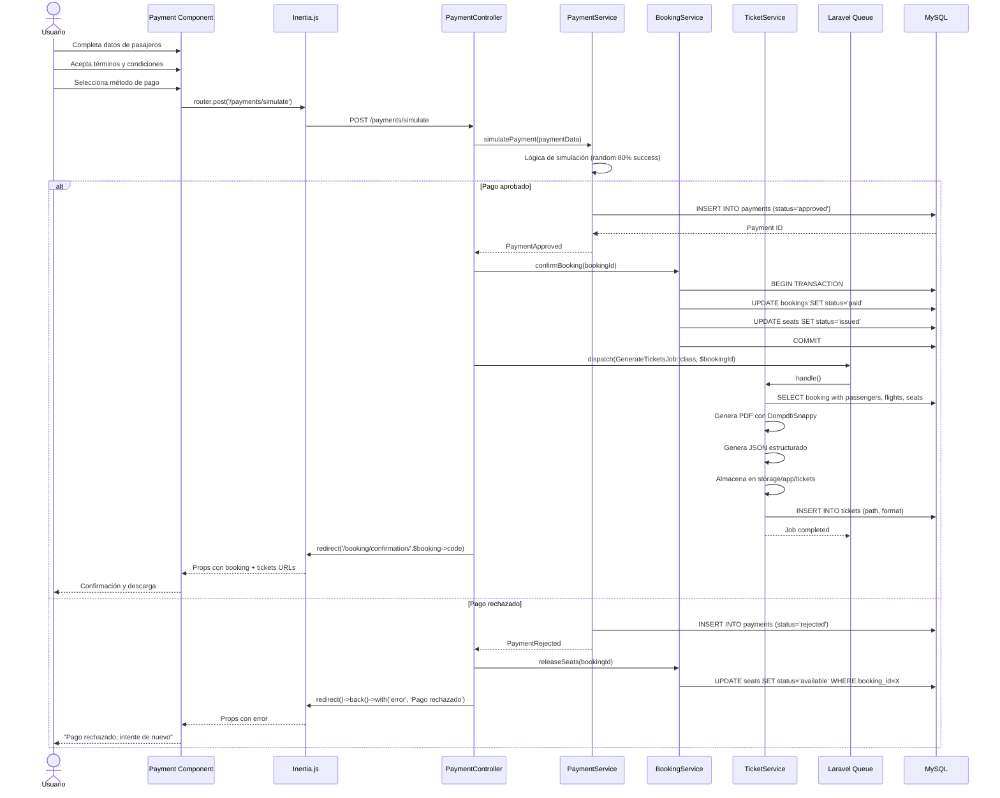
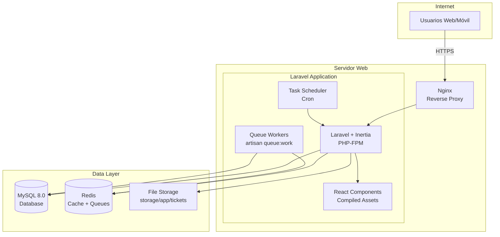

# Arquitectura del Sistema – Compra de Tiquetes Aéreos

Documento: versión 1.0  •  Fecha: 2025-10-21

## 1. Introducción

Este documento describe la arquitectura del sistema de compra de tiquetes aéreos, incluyendo componentes principales, patrones arquitectónicos, flujos de datos y consideraciones de despliegue. La arquitectura está diseñada para cumplir con los requisitos de concurrencia, integridad de datos y escalabilidad del proyecto SENASOFT 2025.

## 2. Visión general de la arquitectura

### 2.1 Patrón arquitectónico
El sistema utiliza una **arquitectura monolítica moderna** con Inertia.js como puente entre backend y frontend:

- **Capa de Presentación (Frontend)**: React con Inertia.js para SPA sin API separada
- **Capa de Lógica de Negocio (Backend)**: Laravel con Eloquent ORM y controladores
- **Capa de Datos**: Base de datos MySQL con integridad referencial

### 2.2 Stack tecnológico propuesto

**Frontend:**
- React 18+ (componentes funcionales y hooks)
- Inertia.js (adaptador para SPA sin API REST tradicional)
- TailwindCSS (estilos utility-first)
- Vite (build tool y hot reload)

**Backend:**
- Laravel 10+ (framework PHP monolítico)
- Inertia.js Laravel Adapter
- Eloquent ORM (mapeo objeto-relacional)
- Laravel Sanctum (autenticación, opcional)
- Laravel Queue (jobs en segundo plano)
- Laravel Scheduler (tareas programadas)

**Base de datos:**
- MySQL 8.0+ (base de datos relacional)
- Redis (opcional, para caché y colas)

**Herramientas de desarrollo:**
- Composer (gestión de dependencias PHP)
- NPM/PNPM (gestión de dependencias JavaScript)
- Laravel Mix / Vite (compilación de assets)

**Despliegue (opcional):**
- Servidor web: Nginx + PHP-FPM
- Plataformas: Railway, Render, DigitalOcean, AWS EC2


## 3. Diagrama de arquitectura de alto nivel (Monolítica con Inertia.js)



## 4. Componentes principales

### 4.1 Frontend (React + Inertia.js)

**Responsabilidades:**
- Renderizar componentes React como SPA
- Recibir datos (props) desde Laravel vía Inertia.js
- Validación de datos en el cliente
- Navegación sin recarga completa de página
- Experiencia de usuario fluida y responsive

**Tecnología:**
- React 18+ con hooks (useState, useEffect, useForm de Inertia)
- Inertia.js para comunicación con Laravel (sin API REST)
- TailwindCSS para estilos
- Componentes organizados por página/módulo

**Páginas/Componentes clave:**
- **`Pages/Flights/Search.jsx`**: Búsqueda de vuelos con autocompletado
- **`Pages/Flights/Results.jsx`**: Visualización de resultados
- **`Pages/Seats/Select.jsx`**: Mapa interactivo de asientos
- **`Pages/Booking/Passengers.jsx`**: Formulario de pasajeros
- **`Pages/Payment/Simulate.jsx`**: Simulación de pago
- **`Pages/Booking/Confirmation.jsx`**: Confirmación y descarga de tiquetes
- **`Components/`**: Componentes reutilizables (SeatsMap, FlightCard, PassengerForm, etc.)

**Flujo de navegación Inertia:**
```javascript
// Ejemplo de navegación sin recarga
import { router } from '@inertiajs/react';

router.visit('/flights/search', {
  data: { origin, destination, date },
  preserveState: true,
  preserveScroll: true
});
```

### 4.2 Backend (Laravel Monolítico)

**Responsabilidades:**
- Procesar requests de Inertia.js
- Ejecutar lógica de negocio
- Validación de datos del lado del servidor
- Control de transacciones y concurrencia
- Gestión de sesiones y autenticación
- Renderizar respuestas Inertia con props

**Controladores principales:**

#### FlightController
- `index()` - Renderizar página de búsqueda
- `search(Request $request)` - Buscar vuelos (retorna Inertia response con props)
- `show(Flight $flight)` - Detalles de un vuelo

#### BookingController
- `create(Request $request)` - Iniciar proceso de reserva
- `store(StoreBookingRequest $request)` - Crear reserva con pasajeros
- `show($code)` - Mostrar confirmación de reserva
- `cancel($id)` - Cancelar reserva

#### SeatController
- `index(Flight $flight)` - Obtener mapa de asientos (Inertia props)
- `reserve(ReserveSeatRequest $request)` - Reservar asientos con lock
- `release($bookingId)` - Liberar asientos reservados

#### PaymentController
- `create(Booking $booking)` - Página de pago
- `simulate(SimulatePaymentRequest $request)` - Simular pago y confirmar
- `callback()` - Callback de pago (simulado)

#### TicketController
- `download($bookingCode)` - Descargar tiquetes en PDF/JSON
- `email(Request $request)` - Enviar tiquetes por correo

**Ejemplo de controlador Inertia:**
```php
namespace App\Http\Controllers;

use Inertia\Inertia;

class FlightController extends Controller
{
    public function search(Request $request)
    {
        $flights = app(FlightService::class)->search(
            $request->validated()
        );
        
        return Inertia::render('Flights/Results', [
            'flights' => $flights,
            'filters' => $request->only(['origin', 'destination', 'date'])
        ]);
    }
}
```

### 4.3 Servicios de lógica de negocio

**FlightService:**
- Búsqueda y filtrado de vuelos
- Cálculo de disponibilidad en tiempo real
- Caché de resultados frecuentes

**BookingService:**
- Creación de reservas transaccionales
- Validación de reglas de negocio (máx. 5 pasajeros, etc.)
- Gestión de estados de reserva
- Liberación automática de reservas expiradas

**SeatService:**
- Control de concurrencia con Optimistic Locking (columna `version`)
- Reserva temporal de asientos (5 minutos)
- Validación de disponibilidad
- Asignación de asientos a pasajeros

**PaymentService:**
- Simulación de pago con lógica configurada (80% aprobado, 20% rechazado)
- Actualización de estado de reserva según resultado
- Registro de transacciones

**TicketService:**
- Generación de PDFs con Laravel Dompdf o Snappy
- Generación de JSON estructurado
- Almacenamiento en `storage/app/tickets`
- Envío de emails con Laravel Mail

### 4.4 Modelos Eloquent

**Principales modelos:**
- `Flight` - Vuelos programados
- `Seat` - Asientos por vuelo
- `Booking` - Reservas
- `Passenger` - Pasajeros
- `Payer` - Pagador
- `Payment` - Transacciones de pago
- `Ticket` - Tiquetes generados
- `City` - Ciudades
- `AircraftModel` - Modelos de aeronave

**Relaciones clave:**
```php
class Booking extends Model
{
    public function passengers()
    {
        return $this->hasMany(Passenger::class);
    }
    
    public function flights()
    {
        return $this->belongsToMany(Flight::class, 'booking_flight');
    }
    
    public function seats()
    {
        return $this->hasMany(Seat::class);
    }
    
    public function payment()
    {
        return $this->hasOne(Payment::class);
    }
}
```

### 4.5 Capa de datos

**Base de datos relacional:**
- MySQL 8.0+ con soporte para transacciones ACID
- Migraciones de Laravel para versionado de esquema
- Seeders para datos de prueba
- Índices optimizados en columnas de búsqueda frecuente
- Constraints para integridad referencial

**Caché (Redis, opcional):**
- Caché de consultas frecuentes (ciudades, modelos de avión)
- Locks distribuidos para control de concurrencia de asientos
- Gestión de cola de jobs

**Almacenamiento de archivos:**
- `storage/app/public/tickets` - Tiquetes generados (PDF)
- Symlink a `public/storage` para acceso web
- Limpieza periódica de archivos antiguos

## 5. Flujos de proceso principales

### 5.1 Flujo de búsqueda y selección de vuelos (Inertia.js)



**Nota:** No hay llamadas API REST. Inertia.js convierte la navegación React en requests HTTP normales a Laravel, que responde con props JSON.

### 5.2 Flujo de selección de asientos y reserva (Laravel + Optimistic Locking)



**Nota:** El Optimistic Locking con columna `version` es la estrategia principal. Redis lock es opcional para evitar intentos simultáneos.

### 5.3 Flujo de pago y confirmación (Laravel)



**Nota:** La generación de tiquetes usa Laravel Queues para no bloquear la respuesta. El usuario recibe confirmación inmediata y los PDF se generan en background.

## 6. Estrategias de control de concurrencia

### 6.1 Problema a resolver
Evitar que dos usuarios reserven el mismo asiento simultáneamente.

### 6.2 Soluciones implementadas (Laravel + MySQL)

#### Opción 1: Optimistic Locking (Recomendada)

**Implementación con Eloquent:**
```php
// Migration
Schema::table('seats', function (Blueprint $table) {
    $table->unsignedInteger('version')->default(0);
});

// Modelo Seat
class Seat extends Model
{
    protected $casts = ['version' => 'integer'];
}

// SeatService
public function reserveSeat(int $seatId, int $bookingId): bool
{
    $seat = Seat::find($seatId);
    $currentVersion = $seat->version;
    
    $updated = Seat::where('id', $seatId)
        ->where('version', $currentVersion)
        ->where('status', 'available')
        ->update([
            'status' => 'reserved',
            'booking_id' => $bookingId,
            'version' => $currentVersion + 1,
            'reserved_at' => now()
        ]);
    
    if ($updated === 0) {
        throw new ConcurrencyException('El asiento ya no está disponible');
    }
    
    return true;
}
```

**Ventajas:**
- Sin bloqueos de base de datos (mejor rendimiento)
- Compatible con réplicas de lectura
- Funciona sin Redis

#### Opción 2: Pessimistic Locking con Laravel

**Implementación:**
```php
DB::transaction(function () use ($seatId, $bookingId) {
    $seat = Seat::where('id', $seatId)
        ->where('status', 'available')
        ->lockForUpdate()  // SELECT ... FOR UPDATE
        ->first();
    
    if (!$seat) {
        throw new SeatNotAvailableException();
    }
    
    $seat->update([
        'status' => 'reserved',
        'booking_id' => $bookingId,
        'reserved_at' => now()
    ]);
});
```

**Ventajas:** Simple, garantiza consistencia fuerte  
**Desventajas:** Puede causar contención en alta concurrencia, bloquea registros

#### Opción 3: Redis Locks (Prevención adicional)

**Implementación con Laravel Cache:**
```php
use Illuminate\Support\Facades\Cache;

public function reserveSeatWithLock(int $seatId, int $bookingId): bool
{
    $lock = Cache::lock("seat:{$seatId}", 10); // 10 segundos
    
    try {
        $lock->block(5); // Espera máximo 5 segundos
        
        // Usa Optimistic Locking dentro del lock
        return $this->reserveSeat($seatId, $bookingId);
        
    } catch (LockTimeoutException $e) {
        throw new SeatBusyException('El asiento está siendo procesado');
    } finally {
        optional($lock)->release();
    }
}
```

**Ventajas:** Alto rendimiento, previene múltiples intentos simultáneos  
**Desventajas:** Requiere Redis configurado

**Configuración Laravel:**
```php
// config/cache.php
'redis' => [
    'client' => env('REDIS_CLIENT', 'phpredis'),
    'options' => [
        'cluster' => env('REDIS_CLUSTER', 'redis'),
        'prefix' => env('REDIS_PREFIX', Str::slug(env('APP_NAME', 'laravel'), '_').'_database_'),
    ],
    'default' => [
        'url' => env('REDIS_URL'),
        'host' => env('REDIS_HOST', '127.0.0.1'),
        'port' => env('REDIS_PORT', '6379'),
        'database' => env('REDIS_CACHE_DB', '1'),
    ],
],
```

### 6.3 Timeout de reservas (Laravel Scheduler)

**Command para liberar reservas:**
```php
// app/Console/Commands/ReleaseExpiredBookings.php
class ReleaseExpiredBookings extends Command
{
    public function handle()
    {
        $expired = Booking::where('status', 'pending')
            ->where('created_at', '<', now()->subMinutes(5))
            ->get();
        
        foreach ($expired as $booking) {
            DB::transaction(function () use ($booking) {
                Seat::where('booking_id', $booking->id)
                    ->update(['status' => 'available', 'booking_id' => null]);
                
                $booking->update(['status' => 'expired']);
            });
        }
        
        $this->info("Liberadas {$expired->count()} reservas expiradas");
    }
}
```

**Programación (app/Console/Kernel.php):**
```php
protected function schedule(Schedule $schedule)
{
    $schedule->command('bookings:release-expired')
        ->everyMinute()
        ->withoutOverlapping();
}
```

## 7. Seguridad

### 7.1 Autenticación (Laravel Sanctum)

**Configuración:**
```php
// Para SPA en mismo dominio
// config/sanctum.php
'stateful' => explode(',', env('SANCTUM_STATEFUL_DOMAINS', sprintf(
    '%s%s',
    'localhost,localhost:3000,127.0.0.1,127.0.0.1:8000,::1',
    env('APP_URL') ? ','.parse_url(env('APP_URL'), PHP_URL_HOST) : ''
))),
```

**Nota:** Para MVP sin autenticación, se puede trabajar con sesiones anónimas.

### 7.2 Validación de datos (Laravel Form Requests)

**Ejemplo:**
```php
// app/Http/Requests/ReserveSeatRequest.php
class ReserveSeatRequest extends FormRequest
{
    public function rules()
    {
        return [
            'seat_ids' => 'required|array|max:5',
            'seat_ids.*' => 'exists:seats,id',
            'booking_id' => 'required|exists:bookings,id',
        ];
    }
}

// Uso en controlador
public function reserve(ReserveSeatRequest $request)
{
    $validated = $request->validated(); // Ya sanitizado y validado
    // ...
}
```

**Validaciones clave:**
- **Frontend**: Validación básica con React Hook Form o similar para UX
- **Backend**: Validación estricta obligatoria (nunca confiar en el cliente)
  - Validación de tipos y formatos
  - Verificación de reglas de negocio (máx. 5 pasajeros, 1 bebé por adulto, etc.)

### 7.3 Protección CSRF (Laravel middleware)

**Automático con Inertia.js:**
```php
// app/Http/Middleware/HandleInertiaRequests.php
class HandleInertiaRequests extends Middleware
{
    public function share(Request $request): array
    {
        return array_merge(parent::share($request), [
            'csrf_token' => csrf_token(), // Disponible en todos los componentes React
            'flash' => [
                'message' => fn () => $request->session()->get('message'),
                'error' => fn () => $request->session()->get('error'),
            ],
        ]);
    }
}
```

**Middleware protección CSRF activo por defecto en rutas web.**

### 7.4 Protección contra ataques

- **SQL Injection**: Eloquent ORM usa prepared statements automáticamente
- **XSS**: React escapa automáticamente, Blade `{{ }}` también
- **CSRF**: Middleware `VerifyCsrfToken` activo por defecto
- **Mass Assignment**: `$fillable` o `$guarded` en modelos Eloquent
- **Rate Limiting**: Laravel Throttle middleware

**Ejemplo Rate Limiting:**
```php
// routes/web.php
Route::middleware(['throttle:60,1'])->group(function () {
    Route::post('/flights/search', [FlightController::class, 'search']);
    Route::post('/seats/reserve', [SeatController::class, 'reserve']);
});
```

## 8. Escalabilidad y rendimiento

### 8.1 Optimizaciones de base de datos (MySQL)

**Índices clave:**
```sql
-- Búsqueda de vuelos
CREATE INDEX idx_flights_search ON flights(origin_airport_id, destination_airport_id, departure_date);

-- Estado de asientos
CREATE INDEX idx_seats_status ON seats(flight_id, status);
CREATE INDEX idx_seats_booking ON seats(booking_id) WHERE booking_id IS NOT NULL;

-- Búsqueda de reservas
CREATE UNIQUE INDEX idx_bookings_code ON bookings(code);
CREATE INDEX idx_bookings_status_created ON bookings(status, created_at);

-- Pasajeros
CREATE INDEX idx_passengers_booking ON passengers(booking_id);
```

**Consultas optimizadas con Eloquent:**
```php
// Eager loading para evitar N+1
$bookings = Booking::with(['passengers', 'seats.flight', 'payment'])
    ->where('code', $code)
    ->first();

// Chunk para procesar muchos registros
Booking::where('status', 'expired')
    ->chunkById(100, function ($bookings) {
        foreach ($bookings as $booking) {
            $this->releaseSeats($booking);
        }
    });
```

### 8.2 Caché de datos (Laravel Cache)

**Configuración:**
```php
// Vuelos disponibles (TTL 5 minutos)
$flights = Cache::remember("flights:{$origin}:{$destination}:{$date}", 300, function () use ($origin, $destination, $date) {
    return Flight::search($origin, $destination, $date)->get();
});

// Catálogos estáticos (TTL 1 día)
$cities = Cache::remember('cities:all', 86400, function () {
    return City::orderBy('name')->get();
});
```

### 8.3 Paginación (Laravel)

```php
// Controlador
$flights = Flight::search($criteria)->paginate(20);

return Inertia::render('Flights/Results', [
    'flights' => $flights, // Inertia maneja automáticamente la paginación
]);
```

```jsx
// React component
import { router } from '@inertiajs/react';

<Pagination 
    links={flights.links} 
    onPageChange={(url) => router.visit(url)}
/>
```

### 8.4 Optimización de assets (Vite)

**vite.config.js:**
```javascript
export default defineConfig({
    plugins: [
        laravel({
            input: 'resources/js/app.jsx',
            refresh: true,
        }),
        react(),
    ],
    build: {
        rollupOptions: {
            output: {
                manualChunks: {
                    vendor: ['react', 'react-dom', '@inertiajs/react'],
                },
            },
        },
    },
});
```

## 9. Monitoreo y logging

### 9.1 Logs de aplicación (Laravel Log)

**Configuración (config/logging.php):**
```php
'channels' => [
    'daily' => [
        'driver' => 'daily',
        'path' => storage_path('logs/laravel.log'),
        'level' => env('LOG_LEVEL', 'debug'),
        'days' => 14,
    ],
],
```

**Uso:**
```php
Log::info('Búsqueda de vuelos', ['origin' => $origin, 'destination' => $destination]);
Log::warning('Conflicto de asiento', ['seat_id' => $seatId, 'user' => $userId]);
Log::error('Error en pago', ['booking_id' => $bookingId, 'exception' => $e->getMessage()]);
```

### 9.2 Métricas clave

- Tiempo de respuesta promedio por ruta (Laravel Telescope)
- Tasa de conversión: búsquedas → reservas → pagos confirmados
- Tasa de conflictos de asientos (columna `version`)
- Disponibilidad del sistema (uptime)
- Jobs en cola pendientes

**Laravel Telescope (desarrollo):**
```bash
composer require laravel/telescope --dev
php artisan telescope:install
php artisan migrate
```

### 9.3 Auditoría

**Modelo de auditoría opcional:**
```php
class AuditLog extends Model
{
    protected $fillable = ['user_id', 'action', 'model', 'model_id', 'data'];
}

// Uso en servicios
AuditLog::create([
    'action' => 'booking.confirmed',
    'model' => 'Booking',
    'model_id' => $booking->id,
    'data' => json_encode($booking->toArray()),
]);
```

## 10. Despliegue

### 10.1 Entornos

- **Desarrollo**: Local (php artisan serve + npm run dev)
- **Staging**: Servidor de pruebas (opcional)
- **Producción**: VPS o plataforma cloud

### 10.2 Configuración de despliegue (Laravel + Inertia.js)

**Variables de entorno (.env):**
```bash
APP_NAME="SENASOFT Airline Booking"
APP_ENV=production
APP_KEY=base64:...  # php artisan key:generate
APP_DEBUG=false
APP_URL=https://tu-dominio.com

DB_CONNECTION=mysql
DB_HOST=127.0.0.1
DB_PORT=3306
DB_DATABASE=airline_booking
DB_USERNAME=root
DB_PASSWORD=

CACHE_DRIVER=redis  # o file si no tienes Redis
QUEUE_CONNECTION=database  # o redis
SESSION_DRIVER=file

REDIS_HOST=127.0.0.1
REDIS_PASSWORD=null
REDIS_PORT=6379
```

**Comandos de despliegue:**
```bash
# 1. Clonar repositorio
git clone https://github.com/cristoferscalante/sena_soft_2025.git
cd sena_soft_2025

# 2. Instalar dependencias backend
composer install --optimize-autoloader --no-dev

# 3. Instalar dependencias frontend
npm install
npm run build  # Genera assets optimizados en public/build

# 4. Configurar entorno
cp .env.example .env
php artisan key:generate

# 5. Migrar base de datos
php artisan migrate --force
php artisan db:seed  # Datos iniciales

# 6. Optimizar para producción
php artisan config:cache
php artisan route:cache
php artisan view:cache

# 7. Permisos
chmod -R 755 storage bootstrap/cache
chown -R www-data:www-data storage bootstrap/cache

# 8. Iniciar scheduler (cron)
# Añadir a crontab:
# * * * * * cd /path-to-project && php artisan schedule:run >> /dev/null 2>&1

# 9. Iniciar queue worker (supervisor)
php artisan queue:work --daemon
```

**Nginx configuración:**
```nginx
server {
    listen 80;
    server_name tu-dominio.com;
    root /var/www/sena_soft_2025/public;

    add_header X-Frame-Options "SAMEORIGIN";
    add_header X-Content-Type-Options "nosniff";

    index index.php;

    charset utf-8;

    location / {
        try_files $uri $uri/ /index.php?$query_string;
    }

    location = /favicon.ico { access_log off; log_not_found off; }
    location = /robots.txt  { access_log off; log_not_found off; }

    error_page 404 /index.php;

    location ~ \.php$ {
        fastcgi_pass unix:/var/run/php/php8.2-fpm.sock;
        fastcgi_param SCRIPT_FILENAME $realpath_root$fastcgi_script_name;
        include fastcgi_params;
    }

    location ~ /\.(?!well-known).* {
        deny all;
    }
}
```

### 10.3 CI/CD con GitHub Actions

```yaml
# .github/workflows/deploy.yml
name: Deploy to Production

on:
  push:
    branches: [ main ]

jobs:
  deploy:
    runs-on: ubuntu-latest
    steps:
      - uses: actions/checkout@v3
      
      - name: Setup PHP
        uses: shivammathur/setup-php@v2
        with:
          php-version: '8.2'
      
      - name: Install Composer dependencies
        run: composer install --no-dev --optimize-autoloader
      
      - name: Install NPM dependencies
        run: npm ci
      
      - name: Build assets
        run: npm run build
      
      - name: Run tests
        run: php artisan test
      
      - name: Deploy to server
        uses: appleboy/ssh-action@master
        with:
          host: ${{ secrets.HOST }}
          username: ${{ secrets.USERNAME }}
          key: ${{ secrets.SSH_KEY }}
          script: |
            cd /var/www/sena_soft_2025
            git pull origin main
            composer install --no-dev
            npm ci && npm run build
            php artisan migrate --force
            php artisan optimize
```

## 11. Diagrama de despliegue (Laravel Monolítico)



**Notas:**
- Todo el sistema corre en un único servidor (monolítico)
- Laravel sirve tanto el backend como los assets de React compilados
- No hay separación de frontend/backend en diferentes servidores
- Escalamiento horizontal posible con load balancer + múltiples instancias + MySQL replication

## 12. Consideraciones para GitFlow

### 12.1 Estrategia de ramas

- `main`: Código en producción, protegida
- `develop`: Integración de features, rama de desarrollo activa
- `feature/*`: Desarrollo de funcionalidades nuevas
- `release/*`: Preparación de releases (testing, fixes)
- `hotfix/*`: Correcciones urgentes en producción

### 12.2 Workflow del equipo

```bash
# Crear feature desde develop
git checkout develop
git pull origin develop
git checkout -b feature/busqueda-vuelos

# Desarrollar y commitear (Conventional Commits)
git add .
git commit -m "feat(flights): implementar búsqueda de vuelos con autocompletado"

# Push y crear Pull Request
git push origin feature/busqueda-vuelos
# Crear PR en GitHub: feature/busqueda-vuelos → develop

# Después de aprobación y merge
git checkout develop
git pull origin develop

# Crear release
git checkout -b release/v1.0.0
# Testing, ajustes de versión, changelog...
git commit -m "chore: preparar release v1.0.0"

# Merge a main y develop
git checkout main
git merge release/v1.0.0
git tag -a v1.0.0 -m "Release v1.0.0"
git push origin main --tags

git checkout develop
git merge release/v1.0.0
git push origin develop

# Hotfix urgente
git checkout main
git checkout -b hotfix/fix-seat-lock
# Fix crítico...
git commit -m "fix(seats): corregir bloqueo de asientos en alta concurrencia"
git checkout main
git merge hotfix/fix-seat-lock
git tag -a v1.0.1 -m "Hotfix v1.0.1"
git checkout develop
git merge hotfix/fix-seat-lock
```

### 12.3 Conventional Commits

**Formato:** `<tipo>(<ámbito>): <descripción>`

**Tipos:**
- `feat`: Nueva funcionalidad
- `fix`: Corrección de bug
- `docs`: Cambios en documentación
- `style`: Formato, espacios, no afecta código
- `refactor`: Refactorización sin cambio de funcionalidad
- `test`: Añadir o modificar tests
- `chore`: Cambios en build, dependencias, etc.

**Ejemplos:**
```bash
git commit -m "feat(seats): agregar mapa interactivo de selección"
git commit -m "fix(payments): validar tarjeta antes de procesar"
git commit -m "docs(readme): actualizar instrucciones de instalación"
git commit -m "refactor(services): extraer lógica de BookingService"
```

## 13. Resumen de decisiones arquitectónicas

| Decisión | Tecnología | Justificación |
|----------|------------|---------------|
| Arquitectura Monolítica | Laravel + Inertia.js | Simplifica desarrollo y despliegue, suficiente para escala del reto, reduce latencia |
| Frontend Framework | React 18+ | Ecosistema robusto, experiencia del equipo, componentes reutilizables |
| Backend Framework | Laravel 10+ | Eloquent ORM, sistema de colas, scheduler, middleware integrado |
| Bridge Frontend-Backend | Inertia.js | Elimina necesidad de API REST separada, routing unificado, SSR-like con SPA UX |
| Base de datos | MySQL 8.0+ | ACID transactions, disponibilidad, experiencia del equipo |
| Control de concurrencia | Optimistic Locking (columna `version`) | Balance entre rendimiento y consistencia, sin bloqueos prolongados |
| Caché opcional | Redis | Alto rendimiento para locks distribuidos y caché de sesiones/colas |
| Gestión de jobs | Laravel Queues | Procesos asíncronos (emails, PDFs), liberación de asientos expirados |
| Generación de PDFs | Laravel Dompdf/Snappy | Integración nativa, fácil uso, tiquetes con formato profesional |
| Autenticación | Laravel Sanctum (opcional) | Listo para escalar a multi-usuario, sesiones stateful para SPA |
| Versionado | Git + GitFlow | Colaboración estructurada, releases controladas, hotfixes rápidos |
| CI/CD | GitHub Actions | Integración con repo, tests automáticos, deploy automatizado |
| Simulación de pago | Lógica interna (80% success) | Requisito del reto, evita complejidad de integraciones externas |

**Ventajas del stack elegido:**
- **Desarrollo rápido:** Inertia.js elimina boilerplate de APIs REST
- **Mantenibilidad:** Código unificado en un repositorio, routing centralizado
- **Rendimiento:** Sin latencia de red entre frontend-backend (mismo servidor)
- **Escalabilidad:** Posible migrar a microservicios si crece (Inertia puede seguir usándose)
- **Experiencia del equipo:** Laravel y React son populares y bien documentados

---

## Próximos pasos

### Fase 1: Configuración inicial (Día 1)
1. ✅ Crear repositorio GitHub con GitFlow
2. ✅ Documentar análisis de requerimientos
3. ✅ Diseñar arquitectura y base de datos
4. Configurar proyecto Laravel + Inertia.js
5. Configurar MySQL y migraciones
6. Setup React + TailwindCSS + Vite

### Fase 2: Desarrollo backend (Día 2-3)
1. Crear modelos Eloquent y relaciones
2. Implementar servicios de lógica de negocio
3. Desarrollar controladores con Inertia responses
4. Implementar control de concurrencia (Optimistic Locking)
5. Configurar Jobs y Scheduler para liberación de asientos
6. Testing de servicios críticos

### Fase 3: Desarrollo frontend (Día 3-4)
1. Crear páginas React con Inertia routing
2. Implementar componentes reutilizables (SeatsMap, FlightCard, etc.)
3. Formularios con validación (React Hook Form)
4. Integrar con backend vía `router.visit()` y `router.post()`
5. Manejo de estados de carga y errores
6. Responsive design con TailwindCSS

### Fase 4: Integración y testing (Día 4-5)
1. Testing end-to-end de flujos completos
2. Pruebas de concurrencia (múltiples usuarios)
3. Validación de generación de tiquetes PDF/JSON
4. Optimización de consultas y caché
5. Preparación para demo

### Fase 5: Presentación (Día 5)
1. Preparar demo en vivo
2. Documentar decisiones técnicas
3. Preparar explicación de arquitectura
4. Video o slides de presentación
