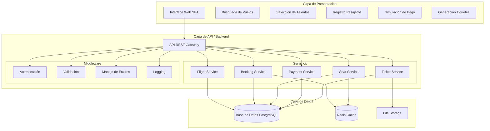
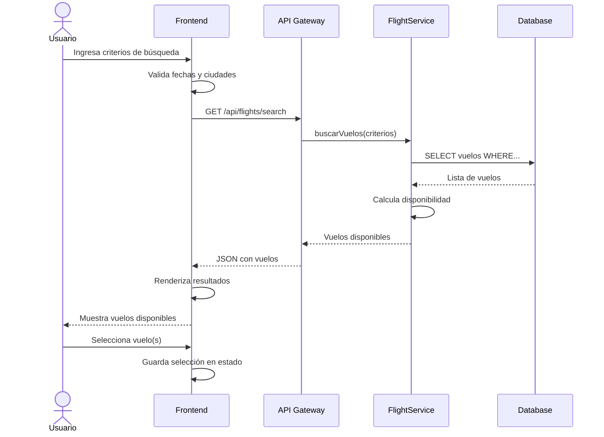
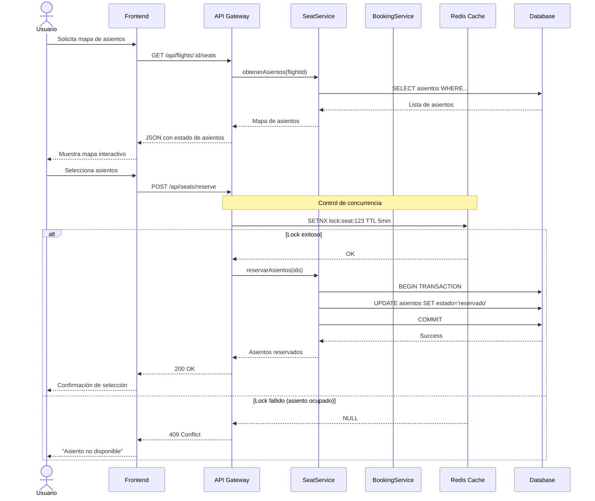
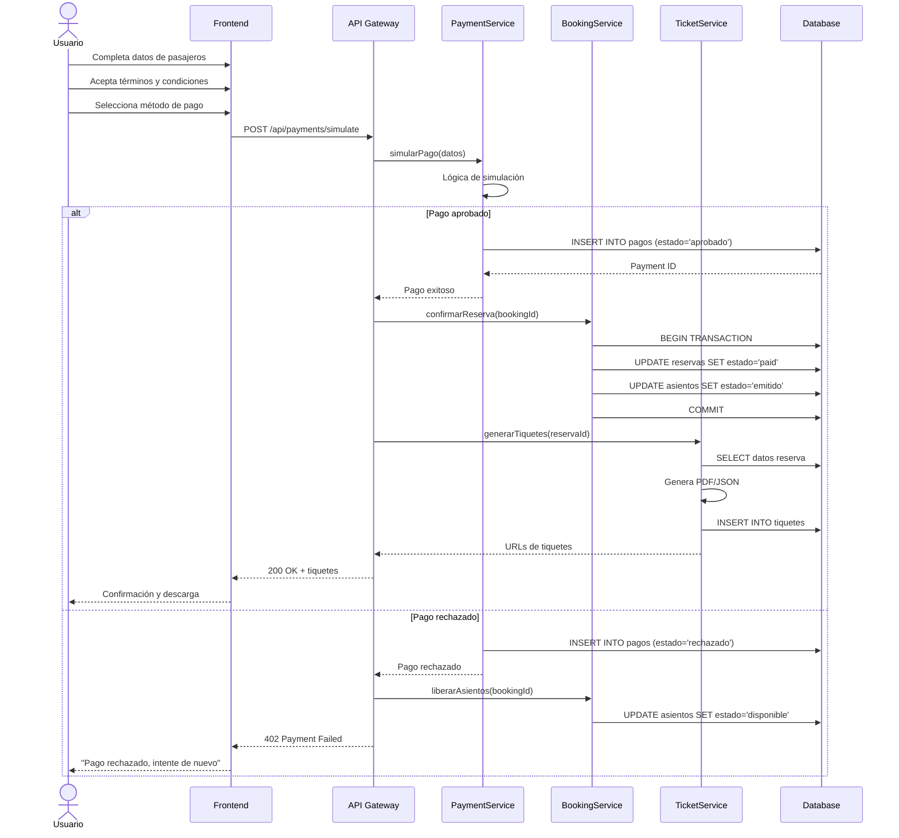
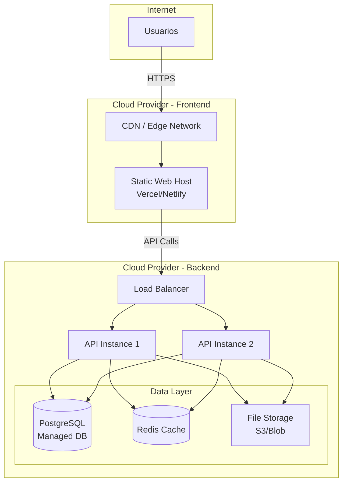

# Arquitectura del Sistema – Compra de Tiquetes Aéreos

Documento: versión 1.0  •  Fecha: 2025-10-21

## 1. Introducción

Este documento describe la arquitectura del sistema de compra de tiquetes aéreos, incluyendo componentes principales, patrones arquitectónicos, flujos de datos y consideraciones de despliegue. La arquitectura está diseñada para cumplir con los requisitos de concurrencia, integridad de datos y escalabilidad del proyecto SENASOFT 2025.

## 2. Visión general de la arquitectura

### 2.1 Patrón arquitectónico
El sistema utiliza una **arquitectura de tres capas** con separación clara de responsabilidades:

- **Capa de Presentación (Frontend)**: Interfaz de usuario responsiva y moderna
- **Capa de Lógica de Negocio (Backend/API)**: Servicios RESTful que gestionan la lógica de negocio
- **Capa de Datos**: Base de datos relacional con integridad referencial

### 2.2 Stack tecnológico propuesto

**Frontend:**
- React / Vue.js / Angular (framework SPA)
- TailwindCSS / Bootstrap (estilos)
- Axios / Fetch API (comunicación HTTP)
- React Query / SWR (caché y estado del servidor)

**Backend:**
- Node.js + Express / Python + FastAPI / Java + Spring Boot
- ORM: Sequelize / TypeORM / SQLAlchemy / JPA
- Autenticación: JWT (opcional)
- Validación: Joi / Zod / Pydantic

**Base de datos:**
- PostgreSQL / MySQL (base de datos relacional principal)
- Redis (caché y control de concurrencia, opcional)

**Despliegue (opcional):**
- Frontend: Vercel / Netlify / Azure Static Web Apps
- Backend: Render / Railway / Azure App Service
- Base de datos: Neon / PlanetScale / Azure Database

## 3. Diagrama de arquitectura de alto nivel



## 4. Componentes principales

### 4.1 Frontend (SPA)

**Responsabilidades:**
- Renderizar interfaces de usuario interactivas
- Validación de datos en el cliente
- Manejo de estado de la aplicación
- Comunicación con la API REST
- Experiencia de usuario fluida y responsive

**Módulos clave:**
- **SearchModule**: Búsqueda de vuelos con filtros y autocompletado
- **FlightSelectionModule**: Visualización y selección de vuelos
- **SeatMapModule**: Mapa interactivo de asientos
- **PassengerFormModule**: Formularios de captura de datos
- **PaymentModule**: Simulación de pago con estados visuales
- **TicketModule**: Visualización y descarga de tiquetes
- **AdminModule** (opcional): Panel de administración

### 4.2 Backend API

**Responsabilidades:**
- Exposición de endpoints RESTful
- Autenticación y autorización
- Validación de datos del lado del servidor
- Ejecución de lógica de negocio
- Control de transacciones y concurrencia
- Logging y auditoría

**Servicios principales:**

#### FlightService
- `GET /api/flights/search` - Buscar vuelos disponibles
- `GET /api/flights/:id` - Obtener detalles de un vuelo
- `GET /api/cities/autocomplete` - Autocompletar ciudades
- `GET /api/aircraft-models` - Listar modelos de aeronaves

#### BookingService
- `POST /api/bookings` - Crear nueva reserva
- `GET /api/bookings/:code` - Consultar reserva por código
- `PUT /api/bookings/:id/confirm` - Confirmar reserva tras pago
- `DELETE /api/bookings/:id` - Cancelar reserva

#### SeatService
- `GET /api/flights/:id/seats` - Obtener mapa de asientos
- `POST /api/seats/reserve` - Reservar asientos (con lock temporal)
- `POST /api/seats/release` - Liberar asientos reservados
- `GET /api/seats/:id/status` - Verificar estado de asiento

#### PaymentService
- `POST /api/payments/simulate` - Simular procesamiento de pago
- `GET /api/payments/:id/status` - Consultar estado de pago

#### TicketService
- `POST /api/tickets/generate` - Generar tiquetes electrónicos
- `GET /api/tickets/:reservationCode` - Descargar tiquetes
- `GET /api/tickets/:id/pdf` - Descargar tiquete en PDF

### 4.3 Capa de datos

**Base de datos relacional:**
- PostgreSQL con soporte para transacciones ACID
- Índices optimizados para búsquedas frecuentes
- Constraints para integridad referencial
- Triggers para auditoría (opcional)

**Caché (opcional):**
- Redis para almacenar:
  - Resultados de búsqueda de vuelos
  - Estado temporal de reservas de asientos
  - Locks distribuidos para control de concurrencia

**Almacenamiento de archivos:**
- Sistema de archivos local o servicio cloud (S3, Azure Blob)
- Almacenamiento de tiquetes generados (PDF/JSON)

## 5. Flujos de proceso principales

### 5.1 Flujo de búsqueda y selección de vuelos



### 5.2 Flujo de selección de asientos y reserva



### 5.3 Flujo de pago y confirmación



## 6. Estrategias de control de concurrencia

### 6.1 Problema a resolver
Evitar que dos usuarios reserven el mismo asiento simultáneamente.

### 6.2 Soluciones implementadas

#### Opción 1: Pessimistic Locking (Base de datos)
```sql
BEGIN TRANSACTION;
SELECT * FROM asientos 
WHERE id = ? AND estado = 'disponible'
FOR UPDATE;  -- Lock exclusivo

-- Si el asiento está disponible
UPDATE asientos 
SET estado = 'reservado', reserva_id = ?
WHERE id = ?;

COMMIT;
```

**Ventajas**: Simple, garantiza consistencia  
**Desventajas**: Puede causar bloqueos en alta concurrencia

#### Opción 2: Optimistic Locking (Version control)
```sql
-- Añadir columna 'version' a tabla asientos
UPDATE asientos 
SET estado = 'reservado', 
    reserva_id = ?, 
    version = version + 1
WHERE id = ? 
  AND estado = 'disponible' 
  AND version = ?;  -- Verifica que no haya cambiado

-- Si affected_rows = 0, el asiento fue tomado
```

**Ventajas**: Mejor rendimiento en concurrencia  
**Desventajas**: Requiere manejo de reintentos

#### Opción 3: Distributed Locks con Redis (Recomendado)
```javascript
// Pseudocódigo
const lockKey = `lock:seat:${seatId}`;
const acquired = await redis.set(lockKey, userId, {
  NX: true,    // Solo si no existe
  EX: 300      // Expira en 5 minutos
});

if (acquired) {
  try {
    // Reservar asiento en DB
    await db.updateSeat(seatId, 'reservado');
    // Procesar reserva...
  } finally {
    await redis.del(lockKey);  // Liberar lock
  }
} else {
  throw new Error('Asiento no disponible');
}
```

**Ventajas**: Alto rendimiento, timeout automático  
**Desventajas**: Requiere Redis

### 6.3 Timeout de reservas
- Los asientos reservados se liberan automáticamente después de 5 minutos si no se completa el pago
- Implementación con scheduled job o TTL en Redis

## 7. Seguridad

### 7.1 Autenticación (opcional para MVP)
- JWT para sesiones de usuario
- Tokens con expiración de 1 hora
- Refresh tokens para renovación

### 7.2 Validación de datos
- **Frontend**: Validación básica para UX
- **Backend**: Validación estricta obligatoria
  - Sanitización de inputs
  - Validación de tipos y formatos
  - Verificación de reglas de negocio

### 7.3 Protección de endpoints
- Rate limiting: máximo 100 peticiones/minuto por IP
- CORS configurado para dominios autorizados
- Headers de seguridad (Helmet.js)

### 7.4 Protección contra ataques
- SQL Injection: uso de prepared statements/ORM
- XSS: sanitización de outputs
- CSRF: tokens CSRF en formularios (si se usa sesiones)

## 8. Escalabilidad y rendimiento

### 8.1 Optimizaciones de base de datos
- Índices en columnas de búsqueda frecuente:
  - `vuelos(origen, destino, fecha)`
  - `asientos(vuelo_id, estado)`
  - `reservas(codigo_unico)`

### 8.2 Caché de datos
- Resultados de búsqueda de vuelos (TTL 5 minutos)
- Catálogos de ciudades y aeropuertos (TTL 1 día)
- Modelos de aeronaves (TTL 1 día)

### 8.3 Paginación
- Resultados de búsqueda: 20 vuelos por página
- Historial de reservas: 10 por página

### 8.4 Compresión
- GZIP para respuestas HTTP
- Minificación de assets estáticos

## 9. Monitoreo y logging

### 9.1 Logs de aplicación
- **Info**: Búsquedas, reservas, pagos exitosos
- **Warning**: Intentos de reserva con conflictos
- **Error**: Fallos de sistema, excepciones

### 9.2 Métricas clave
- Tiempo de respuesta promedio por endpoint
- Tasa de conversión (búsquedas → reservas → pagos)
- Tasa de conflictos de asientos
- Disponibilidad del sistema

### 9.3 Auditoría
- Registro de todas las transacciones de pago
- Historial de cambios de estado de reservas
- Logs de acceso a datos sensibles

## 10. Despliegue

### 10.1 Entornos
- **Desarrollo**: Local (localhost)
- **Staging**: Entorno de pruebas en cloud
- **Producción**: Despliegue público (opcional)

### 10.2 Configuración de despliegue

**Frontend:**
```bash
# Build de producción
npm run build

# Despliegue en Vercel
vercel --prod
```

**Backend:**
```bash
# Variables de entorno
DATABASE_URL=postgresql://...
REDIS_URL=redis://...
JWT_SECRET=...
PORT=3000

# Despliegue en Render
git push origin main  # Auto-deploy configurado
```

### 10.3 CI/CD (opcional)
- GitHub Actions para build y test automático
- Deploy automático en push a `main`
- Rollback automático si fallan health checks

## 11. Diagrama de despliegue



## 12. Consideraciones para GitFlow

### 12.1 Estrategia de ramas
- `main`: Código en producción
- `develop`: Integración de features
- `feature/*`: Desarrollo de funcionalidades
- `release/*`: Preparación de release
- `hotfix/*`: Correcciones urgentes

### 12.2 Workflow del equipo
```bash
# Crear feature
git checkout develop
git checkout -b feature/busqueda-vuelos

# Desarrollar y commitear
git add .
git commit -m "feat: implementar búsqueda de vuelos"

# Merge a develop
git checkout develop
git merge feature/busqueda-vuelos

# Release
git checkout -b release/v1.0.0
# Testing y ajustes...
git checkout main
git merge release/v1.0.0
git tag v1.0.0
```

## 13. Resumen de decisiones arquitectónicas

| Decisión | Justificación |
|----------|---------------|
| Arquitectura de 3 capas | Separación de responsabilidades, mantenibilidad |
| API REST | Estándar de industria, fácil integración |
| PostgreSQL | ACID transactions, integridad referencial |
| Redis para locks | Alto rendimiento en concurrencia |
| SPA Frontend | Experiencia de usuario fluida |
| Optimistic locking | Balance entre rendimiento y consistencia |
| Simulación de pago | Requisito del reto, evita complejidad de integraciones |

---

**Próximos pasos:**
1. Implementar mockups y prototipos UX/UI
2. Configurar repositorio y estructura del proyecto
3. Desarrollar API endpoints prioritarios
4. Implementar lógica de control de concurrencia
5. Testing exhaustivo de flujos críticos
