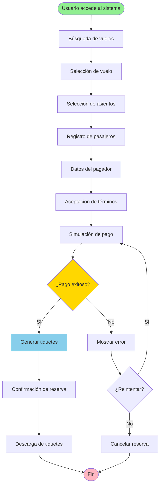
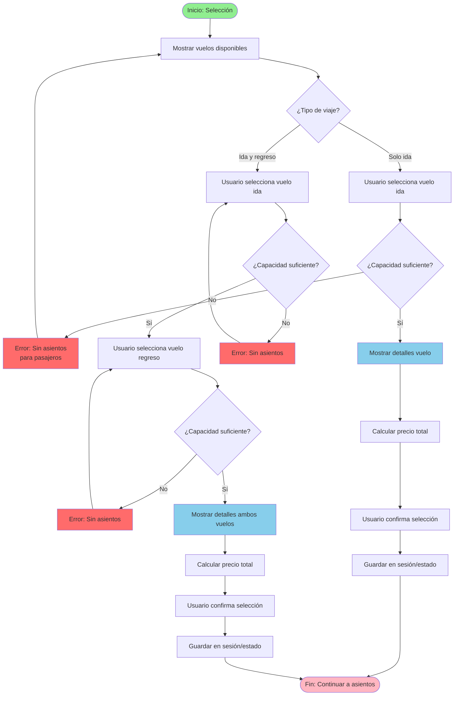
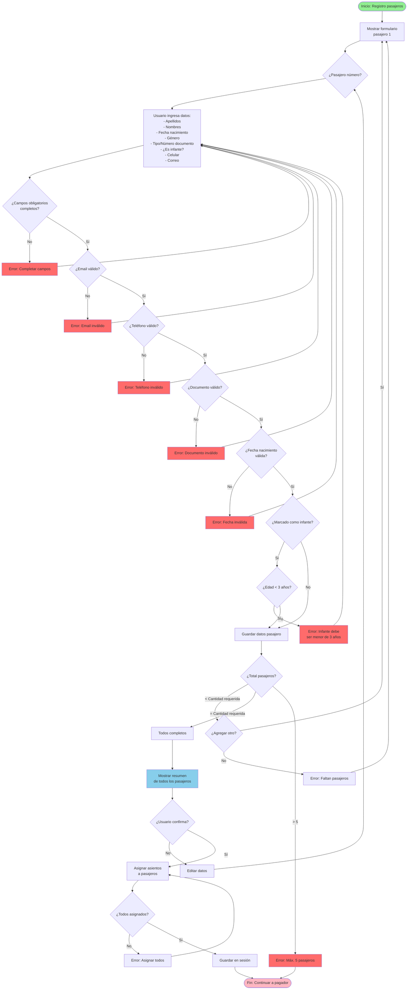
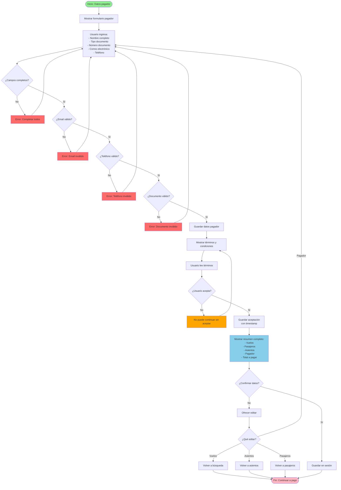
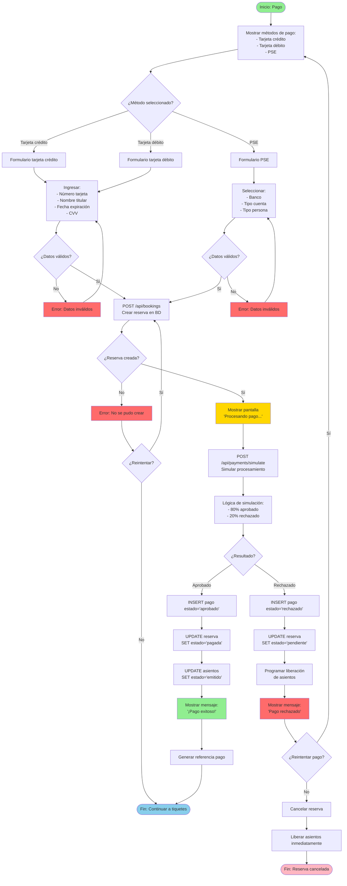
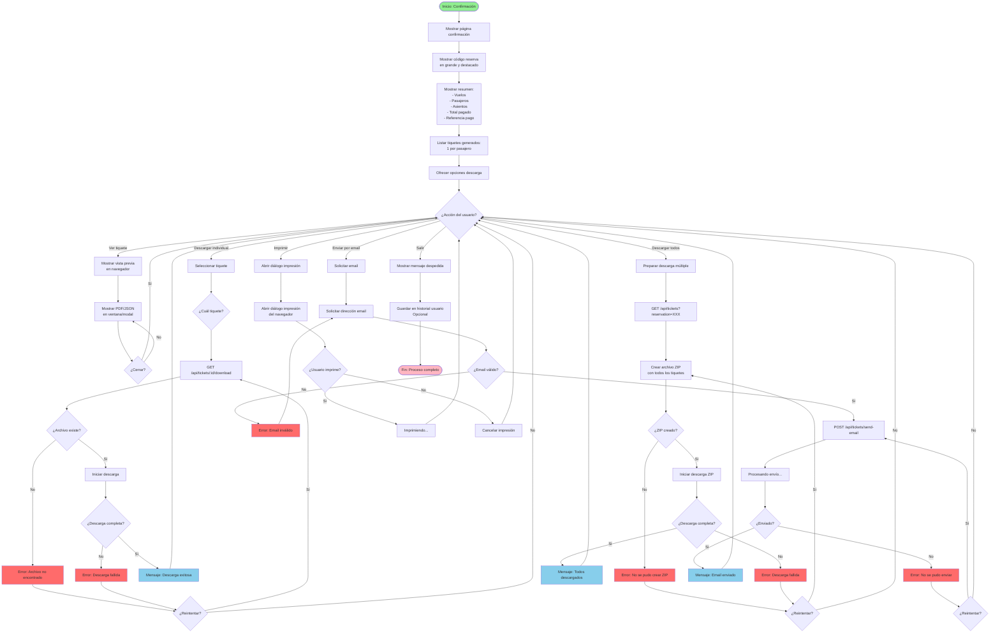
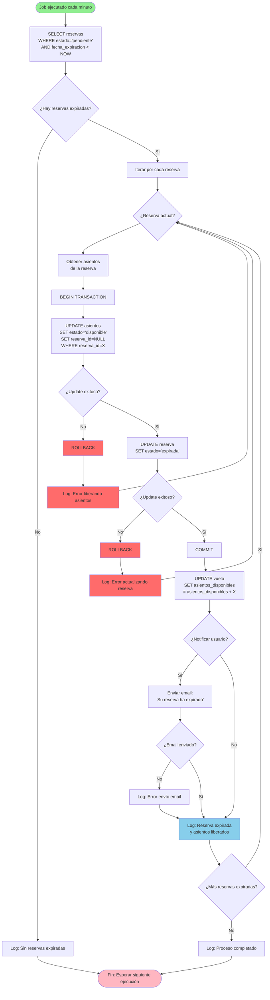

# Diagramas de Flujo – Sistema de Compra de Tiquetes Aéreos

Documento: versión 1.0  •  Fecha: 2025-10-21

## 1. Introducción

Este documento presenta los diagramas de flujo de todas las operaciones principales del sistema de compra de tiquetes aéreos. Cada diagrama muestra el proceso paso a paso, las decisiones y los flujos alternativos para cada funcionalidad.

---

## 2. Flujo General del Sistema

Este diagrama muestra el flujo completo desde que el usuario accede al sistema hasta que obtiene sus tiquetes.



---

## 3. Flujo de Búsqueda de Vuelos

Proceso para buscar vuelos disponibles según criterios del usuario.

```mermaid
flowchart TD
    Start([Inicio: Búsqueda]) --> InputOrigin[Usuario ingresa ciudad origen]
    InputOrigin --> AutocompleteOrigin{¿Autocompletar?}
    AutocompleteOrigin -->|Sí| ShowOriginSuggestions[Mostrar sugerencias]
    AutocompleteOrigin -->|No| InputDestination
    ShowOriginSuggestions --> SelectOrigin[Usuario selecciona ciudad]
    SelectOrigin --> InputDestination[Usuario ingresa ciudad destino]
    
    InputDestination --> AutocompleteDestination{¿Autocompletar?}
    AutocompleteDestination -->|Sí| ShowDestinationSuggestions[Mostrar sugerencias]
    AutocompleteDestination -->|No| ValidateDestination
    ShowDestinationSuggestions --> SelectDestination[Usuario selecciona ciudad]
    SelectDestination --> ValidateDestination{¿Origen ≠ Destino?}
    
    ValidateDestination -->|No| ErrorSameCity[Error: Misma ciudad]
    ValidateDestination -->|Sí| TripType[Seleccionar tipo de viaje]
    ErrorSameCity --> InputDestination
    
    TripType --> OneWay{¿Solo ida?}
    OneWay -->|Sí| SelectDepartureDate[Seleccionar fecha ida]
    OneWay -->|No| SelectDepartureDateRT[Seleccionar fechas ida y regreso]
    
    SelectDepartureDate --> ValidateDate1{¿Fecha válida?<br/>Hoy a +60 días}
    SelectDepartureDateRT --> ValidateDate2{¿Fechas válidas?<br/>Hoy a +60 días}
    
    ValidateDate1 -->|No| ErrorDate1[Error: Fecha inválida]
    ValidateDate1 -->|Sí| SelectPassengers
    ValidateDate2 -->|No| ErrorDate2[Error: Fechas inválidas]
    ValidateDate2 -->|Sí| SelectPassengers
    
    ErrorDate1 --> SelectDepartureDate
    ErrorDate2 --> SelectDepartureDateRT
    
    SelectPassengers[Seleccionar cantidad pasajeros<br/>1-5] --> ValidatePassengers{¿1 ≤ pasajeros ≤ 5?}
    ValidatePassengers -->|No| ErrorPassengers[Error: Máx. 5 pasajeros]
    ValidatePassengers -->|Sí| SearchAPI[Enviar búsqueda a API]
    ErrorPassengers --> SelectPassengers
    
    SearchAPI --> LoadingState[Mostrar estado de carga]
    LoadingState --> APIResponse{¿Respuesta exitosa?}
    
    APIResponse -->|No| ErrorAPI[Error: Problema servidor]
    APIResponse -->|Sí| CheckResults{¿Hay vuelos?}
    ErrorAPI --> RetrySearch{¿Reintentar?}
    RetrySearch -->|Sí| SearchAPI
    RetrySearch -->|No| End
    
    CheckResults -->|No| NoFlights[No hay vuelos disponibles]
    CheckResults -->|Sí| ShowResults[Mostrar lista de vuelos]
    NoFlights --> ModifySearch{¿Modificar búsqueda?}
    ModifySearch -->|Sí| InputOrigin
    ModifySearch -->|No| End
    
    ShowResults --> FilterSort[Usuario filtra/ordena<br/>Opcional]
    FilterSort --> UserSelects[Usuario selecciona vuelo(s)]
    UserSelects --> End([Fin: Vuelo seleccionado])
    
    style Start fill:#90EE90
    style End fill:#FFB6C1
    style ErrorSameCity fill:#FF6B6B
    style ErrorDate1 fill:#FF6B6B
    style ErrorDate2 fill:#FF6B6B
    style ErrorPassengers fill:#FF6B6B
    style ErrorAPI fill:#FF6B6B
    style ShowResults fill:#87CEEB
```

---

## 4. Flujo de Selección de Vuelo

Proceso para seleccionar uno o dos vuelos (ida/regreso) y verificar disponibilidad.



---

## 5. Flujo de Selección de Asientos

Proceso crítico que incluye control de concurrencia para evitar doble reserva.

```mermaid
flowchart TD
    Start([Inicio: Selección asientos]) --> LoadSeats[Cargar mapa de asientos<br/>GET /api/flights/:id/seats]
    LoadSeats --> LoadSuccess{¿Carga exitosa?}
    
    LoadSuccess -->|No| ErrorLoad[Error: No se pudo cargar]
    LoadSuccess -->|Sí| ShowSeatMap[Mostrar mapa interactivo]
    ErrorLoad --> RetryLoad{¿Reintentar?}
    RetryLoad -->|Sí| LoadSeats
    RetryLoad -->|No| End
    
    ShowSeatMap --> CheckPassengers{¿Vuelos múltiples?}
    CheckPassengers -->|Ida solamente| SelectSeatsOutbound[Seleccionar asientos<br/>para vuelo ida]
    CheckPassengers -->|Ida y regreso| SelectSeatsOutbound2[Seleccionar asientos<br/>vuelo ida]
    
    SelectSeatsOutbound --> CountSeats1{¿Asientos = pasajeros?}
    SelectSeatsOutbound2 --> CountSeats2{¿Asientos = pasajeros?}
    
    CountSeats1 -->|No| ErrorCount1[Error: Debe seleccionar<br/>asientos para todos]
    CountSeats1 -->|Sí| ValidateAvailability1[Verificar disponibilidad]
    ErrorCount1 --> SelectSeatsOutbound
    
    CountSeats2 -->|No| ErrorCount2[Error: Completar selección]
    CountSeats2 -->|Sí| SelectSeatsReturn[Seleccionar asientos<br/>vuelo regreso]
    ErrorCount2 --> SelectSeatsOutbound2
    
    SelectSeatsReturn --> CountSeatsReturn{¿Asientos = pasajeros?}
    CountSeatsReturn -->|No| ErrorCountReturn[Error: Completar selección]
    CountSeatsReturn -->|Sí| ValidateAvailability2[Verificar disponibilidad]
    ErrorCountReturn --> SelectSeatsReturn
    
    ValidateAvailability1 --> ReserveSeats1[POST /api/seats/reserve<br/>Intentar reservar asientos]
    ValidateAvailability2 --> ReserveSeats2[POST /api/seats/reserve<br/>Intentar reservar todos asientos]
    
    ReserveSeats1 --> LockAttempt1{¿Lock exitoso?}
    ReserveSeats2 --> LockAttempt2{¿Lock exitoso?}
    
    LockAttempt1 -->|No| Conflict1[409 Conflict<br/>Asiento(s) tomados]
    LockAttempt1 -->|Sí| BeginTransaction1[BEGIN TRANSACTION]
    
    LockAttempt2 -->|No| Conflict2[409 Conflict<br/>Asiento(s) tomados]
    LockAttempt2 -->|Sí| BeginTransaction2[BEGIN TRANSACTION]
    
    Conflict1 --> RefreshMap1[Refrescar mapa]
    Conflict2 --> RefreshMap2[Refrescar mapa]
    RefreshMap1 --> SelectSeatsOutbound
    RefreshMap2 --> SelectSeatsOutbound2
    
    BeginTransaction1 --> UpdateDB1[UPDATE asientos<br/>SET estado='reservado']
    BeginTransaction2 --> UpdateDB2[UPDATE asientos<br/>SET estado='reservado']
    
    UpdateDB1 --> CommitTx1[COMMIT TRANSACTION]
    UpdateDB2 --> CommitTx2[COMMIT TRANSACTION]
    
    CommitTx1 --> Success1{¿Commit exitoso?}
    CommitTx2 --> Success2{¿Commit exitoso?}
    
    Success1 -->|No| Rollback1[ROLLBACK]
    Success1 -->|Sí| SetTimer1[Iniciar timer 5 min<br/>TTL de reserva]
    
    Success2 -->|No| Rollback2[ROLLBACK]
    Success2 -->|Sí| SetTimer2[Iniciar timer 5 min<br/>TTL de reserva]
    
    Rollback1 --> ErrorDB1[Error: Problema BD]
    Rollback2 --> ErrorDB2[Error: Problema BD]
    ErrorDB1 --> RetryReserve1{¿Reintentar?}
    ErrorDB2 --> RetryReserve2{¿Reintentar?}
    RetryReserve1 -->|Sí| ReserveSeats1
    RetryReserve1 -->|No| End
    RetryReserve2 -->|Sí| ReserveSeats2
    RetryReserve2 -->|No| End
    
    SetTimer1 --> SaveSelection1[Guardar selección en sesión]
    SetTimer2 --> SaveSelection2[Guardar selección en sesión]
    
    SaveSelection1 --> ShowConfirmation1[Mostrar confirmación]
    SaveSelection2 --> ShowConfirmation2[Mostrar confirmación]
    
    ShowConfirmation1 --> End([Fin: Continuar a pasajeros])
    ShowConfirmation2 --> End
    
    style Start fill:#90EE90
    style End fill:#FFB6C1
    style Conflict1 fill:#FFA500
    style Conflict2 fill:#FFA500
    style ErrorLoad fill:#FF6B6B
    style ErrorDB1 fill:#FF6B6B
    style ErrorDB2 fill:#FF6B6B
    style SetTimer1 fill:#87CEEB
    style SetTimer2 fill:#87CEEB
```

---

## 6. Flujo de Registro de Pasajeros

Captura de datos de hasta 5 pasajeros con validaciones.



---

## 7. Flujo de Datos del Pagador y Términos

Captura de información del pagador y aceptación de términos y condiciones.



---

## 8. Flujo de Simulación de Pago

Proceso de pago simulado con diferentes métodos y estados.



---

## 9. Flujo de Generación de Tiquetes

Generación de tiquetes electrónicos en formato PDF o JSON.

```mermaid
flowchart TD
    Start([Inicio: Generar tiquetes]) --> GetReservationData[Obtener datos completos:<br/>- Reserva<br/>- Pasajeros<br/>- Vuelos<br/>- Asientos<br/>- Pago]
    
    GetReservationData --> ValidatePayment{¿Pago aprobado?}
    
    ValidatePayment -->|No| ErrorNoPayment[Error: Pago no aprobado]
    ValidatePayment -->|Sí| LoopPassengers[Iterar por cada pasajero]
    ErrorNoPayment --> End
    
    LoopPassengers --> CurrentPassenger{¿Pasajero actual?}
    CurrentPassenger --> GetPassengerData[Obtener datos pasajero]
    GetPassengerData --> GetFlightData[Obtener datos vuelo(s)]
    GetFlightData --> GetSeatData[Obtener asiento(s) asignado(s)]
    
    GetSeatData --> SelectFormat{¿Formato deseado?}
    
    SelectFormat -->|PDF| GeneratePDF[Generar PDF:<br/>- Logo aerolínea<br/>- Código QR<br/>- Datos vuelo<br/>- Datos pasajero<br/>- Asiento<br/>- Barcode]
    SelectFormat -->|JSON| GenerateJSON[Generar JSON estructurado:<br/>- Datos completos<br/>- Formato estándar]
    
    GeneratePDF --> SavePDFFile[Guardar archivo PDF<br/>en storage]
    GenerateJSON --> SaveJSONData[Guardar JSON en BD]
    
    SavePDFFile --> GetPDFURL[Obtener URL de archivo]
    SaveJSONData --> GetJSONContent[Obtener contenido JSON]
    
    GetPDFURL --> InsertTicketRecord1[INSERT INTO tiquetes<br/>formato='pdf']
    GetJSONContent --> InsertTicketRecord2[INSERT INTO tiquetes<br/>formato='json']
    
    InsertTicketRecord1 --> TicketInserted1{¿Insert exitoso?}
    InsertTicketRecord2 --> TicketInserted2{¿Insert exitoso?}
    
    TicketInserted1 -->|No| ErrorInsert1[Error: No se pudo crear]
    TicketInserted1 -->|Sí| GenerateTicketCode1[Generar código tiquete<br/>TKT-XXXXXXXX-001]
    
    TicketInserted2 -->|No| ErrorInsert2[Error: No se pudo crear]
    TicketInserted2 -->|Sí| GenerateTicketCode2[Generar código tiquete<br/>TKT-XXXXXXXX-001]
    
    ErrorInsert1 --> RetryInsert1{¿Reintentar?}
    ErrorInsert2 --> RetryInsert2{¿Reintentar?}
    RetryInsert1 -->|Sí| InsertTicketRecord1
    RetryInsert1 -->|No| End
    RetryInsert2 -->|Sí| InsertTicketRecord2
    RetryInsert2 -->|No| End
    
    GenerateTicketCode1 --> SaveTicketCode1[UPDATE tiquete<br/>SET codigo_tiquete]
    GenerateTicketCode2 --> SaveTicketCode2[UPDATE tiquete<br/>SET codigo_tiquete]
    
    SaveTicketCode1 --> CheckMorePassengers{¿Más pasajeros?}
    SaveTicketCode2 --> CheckMorePassengers
    
    CheckMorePassengers -->|Sí| CurrentPassenger
    CheckMorePassengers -->|No| AllTicketsGenerated[Todos los tiquetes generados]
    
    AllTicketsGenerated --> SendConfirmationEmail[Enviar email confirmación<br/>con enlaces descarga]
    SendConfirmationEmail --> EmailSent{¿Email enviado?}
    
    EmailSent -->|No| LogEmailError[Log: Error envío email]
    EmailSent -->|Sí| UpdateReservationConfirmed[UPDATE reserva<br/>SET estado='confirmada']
    LogEmailError --> UpdateReservationConfirmed
    
    UpdateReservationConfirmed --> End([Fin: Tiquetes generados])
    
    style Start fill:#90EE90
    style End fill:#FFB6C1
    style ErrorNoPayment fill:#FF6B6B
    style ErrorInsert1 fill:#FF6B6B
    style ErrorInsert2 fill:#FF6B6B
    style AllTicketsGenerated fill:#87CEEB
    style SendConfirmationEmail fill:#87CEEB
```

---

## 10. Flujo de Confirmación y Descarga de Tiquetes

Visualización de la confirmación y descarga de tiquetes electrónicos.



---

## 11. Flujo de Liberación de Asientos por Timeout

Proceso automático para liberar asientos cuando expira el tiempo de reserva.



---

## 12. Flujo de Manejo de Errores Global

Estrategia general para manejo de errores en todo el sistema.

```mermaid
flowchart TD
    Start([Error ocurre en sistema]) --> CaptureError[Capturar error<br/>con try-catch o middleware]
    
    CaptureError --> IdentifyErrorType{¿Tipo de error?}
    
    IdentifyErrorType -->|Validación| ValidationError[Error de validación<br/>400 Bad Request]
    IdentifyErrorType -->|Autenticación| AuthError[Error autenticación<br/>401 Unauthorized]
    IdentifyErrorType -->|Autorización| ForbiddenError[Error autorización<br/>403 Forbidden]
    IdentifyErrorType -->|No encontrado| NotFoundError[Recurso no encontrado<br/>404 Not Found]
    IdentifyErrorType -->|Conflicto| ConflictError[Error conflicto<br/>409 Conflict]
    IdentifyErrorType -->|Servidor| ServerError[Error interno servidor<br/>500 Internal Server Error]
    IdentifyErrorType -->|Base datos| DBError[Error base datos<br/>500/503]
    IdentifyErrorType -->|Timeout| TimeoutError[Error timeout<br/>408/504]
    
    ValidationError --> LogError1[Log error con detalles]
    AuthError --> LogError2[Log intento acceso]
    ForbiddenError --> LogError3[Log intento no autorizado]
    NotFoundError --> LogError4[Log recurso no encontrado]
    ConflictError --> LogError5[Log conflicto de concurrencia]
    ServerError --> LogError6[Log error crítico + stack]
    DBError --> LogError7[Log error BD + query]
    TimeoutError --> LogError8[Log timeout + operación]
    
    LogError1 --> PrepareUserMessage1[Mensaje usuario:<br/>'Datos inválidos: X']
    LogError2 --> PrepareUserMessage2[Mensaje usuario:<br/>'Sesión expirada']
    LogError3 --> PrepareUserMessage3[Mensaje usuario:<br/>'Sin permisos']
    LogError4 --> PrepareUserMessage4[Mensaje usuario:<br/>'No encontrado']
    LogError5 --> PrepareUserMessage5[Mensaje usuario:<br/>'Recurso no disponible']
    LogError6 --> PrepareUserMessage6[Mensaje usuario:<br/>'Error del sistema']
    LogError7 --> PrepareUserMessage7[Mensaje usuario:<br/>'Error de conexión']
    LogError8 --> PrepareUserMessage8[Mensaje usuario:<br/>'Tiempo agotado']
    
    PrepareUserMessage1 --> ReturnErrorResponse1[return {<br/>status: 400,<br/>message: X,<br/>code: 'VALIDATION_ERROR'<br/>}]
    PrepareUserMessage2 --> ReturnErrorResponse2[return {<br/>status: 401,<br/>message: X,<br/>code: 'AUTH_ERROR'<br/>}]
    PrepareUserMessage3 --> ReturnErrorResponse3[return {<br/>status: 403,<br/>message: X,<br/>code: 'FORBIDDEN'<br/>}]
    PrepareUserMessage4 --> ReturnErrorResponse4[return {<br/>status: 404,<br/>message: X,<br/>code: 'NOT_FOUND'<br/>}]
    PrepareUserMessage5 --> ReturnErrorResponse5[return {<br/>status: 409,<br/>message: X,<br/>code: 'CONFLICT'<br/>}]
    PrepareUserMessage6 --> ReturnErrorResponse6[return {<br/>status: 500,<br/>message: X,<br/>code: 'SERVER_ERROR'<br/>}]
    PrepareUserMessage7 --> ReturnErrorResponse7[return {<br/>status: 500,<br/>message: X,<br/>code: 'DB_ERROR'<br/>}]
    PrepareUserMessage8 --> ReturnErrorResponse8[return {<br/>status: 408,<br/>message: X,<br/>code: 'TIMEOUT'<br/>}]
    
    ReturnErrorResponse1 --> FrontendReceives[Frontend recibe respuesta]
    ReturnErrorResponse2 --> FrontendReceives
    ReturnErrorResponse3 --> FrontendReceives
    ReturnErrorResponse4 --> FrontendReceives
    ReturnErrorResponse5 --> FrontendReceives
    ReturnErrorResponse6 --> FrontendReceives
    ReturnErrorResponse7 --> FrontendReceives
    ReturnErrorResponse8 --> FrontendReceives
    
    FrontendReceives --> DisplayError[Mostrar error en UI:<br/>- Toast notification<br/>- Modal<br/>- Mensaje inline]
    
    DisplayError --> OfferAction{¿Ofrecer acción?}
    OfferAction -->|Reintentar| ShowRetryButton[Mostrar botón 'Reintentar']
    OfferAction -->|Navegar| ShowNavigationButton[Mostrar 'Volver a...']
    OfferAction -->|Contactar| ShowContactInfo[Mostrar 'Contactar soporte']
    OfferAction -->|Solo informar| NoActionNeeded[Solo mensaje informativo]
    
    ShowRetryButton --> UserRetries{¿Usuario reintenta?}
    ShowNavigationButton --> UserNavigates[Usuario navega a otra sección]
    ShowContactInfo --> UserContacts[Usuario puede contactar soporte]
    NoActionNeeded --> End
    
    UserRetries -->|Sí| RetryOperation[Ejecutar operación nuevamente]
    UserRetries -->|No| End
    RetryOperation --> End
    UserNavigates --> End
    UserContacts --> End
    
    End([Fin: Error manejado])
    
    style Start fill:#FF6B6B
    style End fill:#FFB6C1
    style ConflictError fill:#FFA500
    style ServerError fill:#FF0000
    style DBError fill:#FF0000
    style DisplayError fill:#FFD700
```

---

## 13. Resumen de operaciones cubiertas

Este documento incluye diagramas de flujo detallados para:

1. ✅ **Flujo general del sistema** - Visión completa del proceso
2. ✅ **Búsqueda de vuelos** - Con autocompletado y validaciones
3. ✅ **Selección de vuelo** - Verificación de capacidad
4. ✅ **Selección de asientos** - Con control de concurrencia crítico
5. ✅ **Registro de pasajeros** - Hasta 5 pasajeros con validaciones
6. ✅ **Datos del pagador** - Con términos y condiciones
7. ✅ **Simulación de pago** - Múltiples métodos (crédito, débito, PSE)
8. ✅ **Generación de tiquetes** - Formato PDF y JSON
9. ✅ **Confirmación y descarga** - Múltiples opciones de descarga
10. ✅ **Liberación de asientos** - Proceso automático por timeout
11. ✅ **Manejo de errores** - Estrategia global

Cada diagrama puede ser visualizado en herramientas compatibles con Mermaid como:
- GitHub/GitLab (renderizado automático)
- VS Code (con extensión Mermaid)
- Mermaid Live Editor (https://mermaid.live)
- Notion, Obsidian, etc.

---

**Notas importantes:**
- Los diagramas incluyen flujos felices y alternativos (errores)
- Se destacan puntos críticos de concurrencia y validación
- Los colores ayudan a identificar estados: verde (inicio), azul (éxito), rojo (error), naranja (advertencia)
- Cada operación considera reintentos y manejo de errores apropiado

**Próximos pasos:**
1. Revisar y validar flujos con el equipo
2. Implementar cada flujo según los diagramas
3. Crear tests que verifiquen cada camino del diagrama
4. Documentar cambios si los flujos se modifican durante desarrollo
