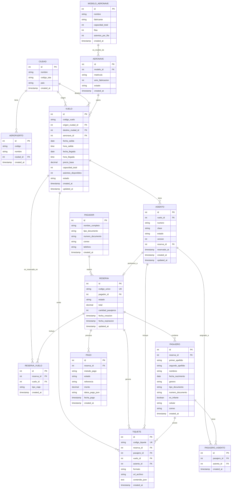

# Diseño de Base de Datos – Sistema de Compra de Tiquetes Aéreos

Documento: versión 1.0  •  Fecha: 2025-10-21

## 1. Introducción

Este documento describe el diseño completo de la base de datos del sistema de compra de tiquetes aéreos, incluyendo el modelo entidad-relación, esquemas de tablas, índices, restricciones y estrategias de optimización y concurrencia.

## 2. Modelo Entidad-Relación (ER)

### 2.1 Diagrama ER



## 3. Definición detallada de tablas

### 3.1 Tabla: `ciudades`

Almacena las ciudades disponibles para origen/destino de vuelos.

```sql
CREATE TABLE ciudades (
    id SERIAL PRIMARY KEY,
    nombre VARCHAR(100) NOT NULL,
    codigo_iata VARCHAR(3) NOT NULL UNIQUE,
    pais VARCHAR(100) NOT NULL,
    created_at TIMESTAMP DEFAULT CURRENT_TIMESTAMP,
    
    INDEX idx_ciudad_nombre (nombre),
    INDEX idx_ciudad_iata (codigo_iata)
);
```

**Datos de ejemplo:**
```sql
INSERT INTO ciudades (nombre, codigo_iata, pais) VALUES
('Bogotá', 'BOG', 'Colombia'),
('Medellín', 'MDE', 'Colombia'),
('Cali', 'CLO', 'Colombia'),
('Cartagena', 'CTG', 'Colombia'),
('Barranquilla', 'BAQ', 'Colombia'),
('Santa Marta', 'SMR', 'Colombia');
```

### 3.2 Tabla: `aeropuertos` (opcional)

```sql
CREATE TABLE aeropuertos (
    id SERIAL PRIMARY KEY,
    codigo VARCHAR(10) NOT NULL UNIQUE,
    nombre VARCHAR(200) NOT NULL,
    ciudad_id INTEGER NOT NULL REFERENCES ciudades(id),
    created_at TIMESTAMP DEFAULT CURRENT_TIMESTAMP,
    
    INDEX idx_aeropuerto_ciudad (ciudad_id)
);
```

### 3.3 Tabla: `modelos_aeronave`

Define los modelos de avión y su capacidad.

```sql
CREATE TABLE modelos_aeronave (
    id SERIAL PRIMARY KEY,
    nombre VARCHAR(100) NOT NULL,
    fabricante VARCHAR(100) NOT NULL,
    capacidad_total INTEGER NOT NULL CHECK (capacidad_total > 0),
    filas INTEGER NOT NULL,
    asientos_por_fila INTEGER NOT NULL,
    created_at TIMESTAMP DEFAULT CURRENT_TIMESTAMP,
    
    CONSTRAINT chk_capacidad CHECK (capacidad_total = filas * asientos_por_fila)
);
```

**Datos de ejemplo:**
```sql
INSERT INTO modelos_aeronave (nombre, fabricante, capacidad_total, filas, asientos_por_fila) VALUES
('Boeing 737-800', 'Boeing', 180, 30, 6),
('Airbus A320', 'Airbus', 150, 25, 6),
('Embraer E190', 'Embraer', 100, 25, 4),
('ATR 72-600', 'ATR', 72, 18, 4);
```

### 3.4 Tabla: `aeronaves`

Aeronaves específicas de la flota.

```sql
CREATE TABLE aeronaves (
    id SERIAL PRIMARY KEY,
    modelo_id INTEGER NOT NULL REFERENCES modelos_aeronave(id),
    matricula VARCHAR(20) NOT NULL UNIQUE,
    anio_fabricacion INTEGER,
    estado VARCHAR(20) DEFAULT 'activo' CHECK (estado IN ('activo', 'mantenimiento', 'fuera_servicio')),
    created_at TIMESTAMP DEFAULT CURRENT_TIMESTAMP,
    
    INDEX idx_aeronave_modelo (modelo_id),
    INDEX idx_aeronave_estado (estado)
);
```

### 3.5 Tabla: `vuelos`

Información de vuelos programados.

```sql
CREATE TABLE vuelos (
    id SERIAL PRIMARY KEY,
    codigo_vuelo VARCHAR(10) NOT NULL,
    origen_ciudad_id INTEGER NOT NULL REFERENCES ciudades(id),
    destino_ciudad_id INTEGER NOT NULL REFERENCES ciudades(id),
    aeronave_id INTEGER NOT NULL REFERENCES aeronaves(id),
    fecha_salida DATE NOT NULL,
    hora_salida TIME NOT NULL,
    fecha_llegada DATE NOT NULL,
    hora_llegada TIME NOT NULL,
    precio_base DECIMAL(10,2) NOT NULL CHECK (precio_base > 0),
    capacidad_total INTEGER NOT NULL,
    asientos_disponibles INTEGER NOT NULL,
    estado VARCHAR(20) DEFAULT 'programado' CHECK (estado IN ('programado', 'en_vuelo', 'completado', 'cancelado')),
    created_at TIMESTAMP DEFAULT CURRENT_TIMESTAMP,
    updated_at TIMESTAMP DEFAULT CURRENT_TIMESTAMP,
    
    CONSTRAINT chk_origen_destino CHECK (origen_ciudad_id != destino_ciudad_id),
    CONSTRAINT chk_fecha_llegada CHECK (fecha_llegada >= fecha_salida),
    CONSTRAINT chk_asientos CHECK (asientos_disponibles >= 0 AND asientos_disponibles <= capacidad_total),
    
    INDEX idx_vuelo_origen_destino_fecha (origen_ciudad_id, destino_ciudad_id, fecha_salida),
    INDEX idx_vuelo_fecha (fecha_salida),
    INDEX idx_vuelo_codigo (codigo_vuelo),
    INDEX idx_vuelo_estado (estado)
);
```

**Trigger para actualizar disponibilidad:**
```sql
CREATE OR REPLACE FUNCTION actualizar_asientos_disponibles()
RETURNS TRIGGER AS $$
BEGIN
    UPDATE vuelos
    SET asientos_disponibles = capacidad_total - (
        SELECT COUNT(*) FROM asientos 
        WHERE vuelo_id = NEW.vuelo_id 
        AND estado IN ('reservado', 'emitido')
    )
    WHERE id = NEW.vuelo_id;
    
    RETURN NEW;
END;
$$ LANGUAGE plpgsql;

CREATE TRIGGER trg_actualizar_disponibilidad
AFTER INSERT OR UPDATE OF estado ON asientos
FOR EACH ROW
EXECUTE FUNCTION actualizar_asientos_disponibles();
```

### 3.6 Tabla: `asientos`

Control de asientos por vuelo con versionado para concurrencia.

```sql
CREATE TABLE asientos (
    id SERIAL PRIMARY KEY,
    vuelo_id INTEGER NOT NULL REFERENCES vuelos(id) ON DELETE CASCADE,
    numero VARCHAR(10) NOT NULL,
    clase VARCHAR(20) DEFAULT 'economica' CHECK (clase IN ('economica', 'ejecutiva', 'primera')),
    estado VARCHAR(20) DEFAULT 'disponible' CHECK (estado IN ('disponible', 'reservado', 'emitido', 'bloqueado')),
    version INTEGER DEFAULT 0 NOT NULL,  -- Para optimistic locking
    reserva_id INTEGER REFERENCES reservas(id) ON DELETE SET NULL,
    reservado_at TIMESTAMP,
    created_at TIMESTAMP DEFAULT CURRENT_TIMESTAMP,
    updated_at TIMESTAMP DEFAULT CURRENT_TIMESTAMP,
    
    UNIQUE (vuelo_id, numero),
    
    INDEX idx_asiento_vuelo_estado (vuelo_id, estado),
    INDEX idx_asiento_reserva (reserva_id)
);
```

**Trigger para generar asientos al crear vuelo:**
```sql
CREATE OR REPLACE FUNCTION generar_asientos_vuelo()
RETURNS TRIGGER AS $$
DECLARE
    modelo_rec RECORD;
    fila INTEGER;
    col INTEGER;
    letra CHAR;
BEGIN
    -- Obtener configuración del modelo
    SELECT m.filas, m.asientos_por_fila
    INTO modelo_rec
    FROM modelos_aeronave m
    JOIN aeronaves a ON a.modelo_id = m.id
    WHERE a.id = NEW.aeronave_id;
    
    -- Generar asientos
    FOR fila IN 1..modelo_rec.filas LOOP
        FOR col IN 1..modelo_rec.asientos_por_fila LOOP
            letra := CHR(64 + col);  -- A, B, C, D, E, F
            INSERT INTO asientos (vuelo_id, numero, clase)
            VALUES (NEW.id, fila || letra, 'economica');
        END LOOP;
    END LOOP;
    
    RETURN NEW;
END;
$$ LANGUAGE plpgsql;

CREATE TRIGGER trg_generar_asientos
AFTER INSERT ON vuelos
FOR EACH ROW
EXECUTE FUNCTION generar_asientos_vuelo();
```

### 3.7 Tabla: `pagadores`

Información del pagador de la reserva.

```sql
CREATE TABLE pagadores (
    id SERIAL PRIMARY KEY,
    nombre_completo VARCHAR(200) NOT NULL,
    tipo_documento VARCHAR(20) NOT NULL CHECK (tipo_documento IN ('CC', 'CE', 'Pasaporte', 'TI')),
    numero_documento VARCHAR(50) NOT NULL,
    correo VARCHAR(100) NOT NULL,
    telefono VARCHAR(20) NOT NULL,
    created_at TIMESTAMP DEFAULT CURRENT_TIMESTAMP,
    
    INDEX idx_pagador_documento (tipo_documento, numero_documento)
);
```

### 3.8 Tabla: `reservas`

Reservas realizadas por los usuarios.

```sql
CREATE TABLE reservas (
    id SERIAL PRIMARY KEY,
    codigo_unico VARCHAR(8) NOT NULL UNIQUE,  -- Ej: "AB12CD34"
    pagador_id INTEGER NOT NULL REFERENCES pagadores(id),
    estado VARCHAR(20) DEFAULT 'pendiente' CHECK (estado IN ('pendiente', 'pagada', 'confirmada', 'cancelada', 'expirada')),
    total DECIMAL(10,2) NOT NULL CHECK (total >= 0),
    cantidad_pasajeros INTEGER NOT NULL CHECK (cantidad_pasajeros BETWEEN 1 AND 5),
    terminos_aceptados BOOLEAN DEFAULT FALSE NOT NULL,
    fecha_creacion TIMESTAMP DEFAULT CURRENT_TIMESTAMP,
    fecha_expiracion TIMESTAMP NOT NULL,  -- 5 minutos después de creación
    updated_at TIMESTAMP DEFAULT CURRENT_TIMESTAMP,
    
    INDEX idx_reserva_codigo (codigo_unico),
    INDEX idx_reserva_estado (estado),
    INDEX idx_reserva_fecha_creacion (fecha_creacion),
    INDEX idx_reserva_expiracion (fecha_expiracion, estado)
);
```

**Función para generar código único:**
```sql
CREATE OR REPLACE FUNCTION generar_codigo_reserva()
RETURNS TRIGGER AS $$
BEGIN
    NEW.codigo_unico := UPPER(SUBSTRING(MD5(RANDOM()::TEXT) FROM 1 FOR 8));
    NEW.fecha_expiracion := CURRENT_TIMESTAMP + INTERVAL '5 minutes';
    RETURN NEW;
END;
$$ LANGUAGE plpgsql;

CREATE TRIGGER trg_codigo_reserva
BEFORE INSERT ON reservas
FOR EACH ROW
EXECUTE FUNCTION generar_codigo_reserva();
```

**Job para liberar reservas expiradas:**
```sql
-- Ejecutar periódicamente (cada minuto)
CREATE OR REPLACE FUNCTION liberar_reservas_expiradas()
RETURNS void AS $$
BEGIN
    -- Actualizar asientos a disponible
    UPDATE asientos
    SET estado = 'disponible', 
        reserva_id = NULL,
        reservado_at = NULL
    WHERE reserva_id IN (
        SELECT id FROM reservas 
        WHERE estado = 'pendiente' 
        AND fecha_expiracion < CURRENT_TIMESTAMP
    );
    
    -- Marcar reservas como expiradas
    UPDATE reservas
    SET estado = 'expirada'
    WHERE estado = 'pendiente'
    AND fecha_expiracion < CURRENT_TIMESTAMP;
END;
$$ LANGUAGE plpgsql;
```

### 3.9 Tabla: `reservas_vuelos`

Relación muchos a muchos entre reservas y vuelos (para ida y regreso).

```sql
CREATE TABLE reservas_vuelos (
    id SERIAL PRIMARY KEY,
    reserva_id INTEGER NOT NULL REFERENCES reservas(id) ON DELETE CASCADE,
    vuelo_id INTEGER NOT NULL REFERENCES vuelos(id),
    tipo_viaje VARCHAR(10) CHECK (tipo_viaje IN ('ida', 'regreso')),
    created_at TIMESTAMP DEFAULT CURRENT_TIMESTAMP,
    
    UNIQUE (reserva_id, vuelo_id),
    INDEX idx_reserva_vuelo (reserva_id, vuelo_id)
);
```

### 3.10 Tabla: `pasajeros`

Datos de los pasajeros en cada reserva.

```sql
CREATE TABLE pasajeros (
    id SERIAL PRIMARY KEY,
    reserva_id INTEGER NOT NULL REFERENCES reservas(id) ON DELETE CASCADE,
    primer_apellido VARCHAR(100) NOT NULL,
    segundo_apellido VARCHAR(100),
    nombres VARCHAR(200) NOT NULL,
    fecha_nacimiento DATE NOT NULL,
    genero VARCHAR(20) CHECK (genero IN ('M', 'F', 'Otro')),
    tipo_documento VARCHAR(20) NOT NULL CHECK (tipo_documento IN ('CC', 'CE', 'Pasaporte', 'TI', 'RC')),
    numero_documento VARCHAR(50) NOT NULL,
    es_infante BOOLEAN DEFAULT FALSE,  -- Menor de 3 años
    celular VARCHAR(20) NOT NULL,
    correo VARCHAR(100) NOT NULL,
    created_at TIMESTAMP DEFAULT CURRENT_TIMESTAMP,
    
    INDEX idx_pasajero_reserva (reserva_id),
    INDEX idx_pasajero_documento (tipo_documento, numero_documento)
);
```

**Trigger para validar edad de infante:**
```sql
CREATE OR REPLACE FUNCTION validar_infante()
RETURNS TRIGGER AS $$
BEGIN
    IF NEW.es_infante THEN
        IF (CURRENT_DATE - NEW.fecha_nacimiento) > INTERVAL '3 years' THEN
            RAISE EXCEPTION 'Un pasajero marcado como infante debe tener menos de 3 años';
        END IF;
    END IF;
    RETURN NEW;
END;
$$ LANGUAGE plpgsql;

CREATE TRIGGER trg_validar_infante
BEFORE INSERT OR UPDATE ON pasajeros
FOR EACH ROW
EXECUTE FUNCTION validar_infante();
```

### 3.11 Tabla: `pasajeros_asientos`

Asignación de asientos a pasajeros específicos.

```sql
CREATE TABLE pasajeros_asientos (
    id SERIAL PRIMARY KEY,
    pasajero_id INTEGER NOT NULL REFERENCES pasajeros(id) ON DELETE CASCADE,
    asiento_id INTEGER NOT NULL REFERENCES asientos(id) ON DELETE CASCADE,
    created_at TIMESTAMP DEFAULT CURRENT_TIMESTAMP,
    
    UNIQUE (pasajero_id, asiento_id),
    UNIQUE (asiento_id),  -- Un asiento solo puede estar asignado a un pasajero
    
    INDEX idx_pasajero_asiento (pasajero_id),
    INDEX idx_asiento_pasajero (asiento_id)
);
```

### 3.12 Tabla: `pagos`

Registro de transacciones de pago (simuladas).

```sql
CREATE TABLE pagos (
    id SERIAL PRIMARY KEY,
    reserva_id INTEGER NOT NULL REFERENCES reservas(id) ON DELETE CASCADE,
    metodo_pago VARCHAR(20) NOT NULL CHECK (metodo_pago IN ('tarjeta_credito', 'tarjeta_debito', 'pse')),
    estado VARCHAR(20) DEFAULT 'pendiente' CHECK (estado IN ('pendiente', 'aprobado', 'rechazado', 'anulado')),
    referencia VARCHAR(50) UNIQUE,
    monto DECIMAL(10,2) NOT NULL,
    datos_pago_json JSONB,  -- Datos adicionales del pago (últimos 4 dígitos, banco, etc.)
    fecha_pago TIMESTAMP DEFAULT CURRENT_TIMESTAMP,
    created_at TIMESTAMP DEFAULT CURRENT_TIMESTAMP,
    
    INDEX idx_pago_reserva (reserva_id),
    INDEX idx_pago_estado (estado),
    INDEX idx_pago_referencia (referencia)
);
```

**Función para generar referencia de pago:**
```sql
CREATE OR REPLACE FUNCTION generar_referencia_pago()
RETURNS TRIGGER AS $$
BEGIN
    NEW.referencia := 'PAY-' || TO_CHAR(CURRENT_TIMESTAMP, 'YYYYMMDD') || '-' || 
                      LPAD(nextval('seq_pago_referencia')::TEXT, 6, '0');
    RETURN NEW;
END;
$$ LANGUAGE plpgsql;

CREATE SEQUENCE seq_pago_referencia START 1;

CREATE TRIGGER trg_referencia_pago
BEFORE INSERT ON pagos
FOR EACH ROW
EXECUTE FUNCTION generar_referencia_pago();
```

### 3.13 Tabla: `tiquetes`

Tiquetes electrónicos generados.

```sql
CREATE TABLE tiquetes (
    id SERIAL PRIMARY KEY,
    codigo_tiquete VARCHAR(16) NOT NULL UNIQUE,  -- Ej: "TKT-AB12CD34-001"
    reserva_id INTEGER NOT NULL REFERENCES reservas(id) ON DELETE CASCADE,
    pasajero_id INTEGER NOT NULL REFERENCES pasajeros(id) ON DELETE CASCADE,
    vuelo_id INTEGER NOT NULL REFERENCES vuelos(id),
    asiento_id INTEGER NOT NULL REFERENCES asientos(id),
    formato VARCHAR(10) CHECK (formato IN ('pdf', 'json')),
    url_archivo TEXT,  -- URL del PDF en storage
    contenido_json JSONB,  -- Contenido estructurado del tiquete
    created_at TIMESTAMP DEFAULT CURRENT_TIMESTAMP,
    
    INDEX idx_tiquete_codigo (codigo_tiquete),
    INDEX idx_tiquete_reserva (reserva_id),
    INDEX idx_tiquete_pasajero (pasajero_id)
);
```

**Función para generar código de tiquete:**
```sql
CREATE OR REPLACE FUNCTION generar_codigo_tiquete()
RETURNS TRIGGER AS $$
DECLARE
    codigo_reserva VARCHAR(8);
    numero_secuencial INTEGER;
BEGIN
    SELECT codigo_unico INTO codigo_reserva
    FROM reservas WHERE id = NEW.reserva_id;
    
    SELECT COUNT(*) + 1 INTO numero_secuencial
    FROM tiquetes WHERE reserva_id = NEW.reserva_id;
    
    NEW.codigo_tiquete := 'TKT-' || codigo_reserva || '-' || LPAD(numero_secuencial::TEXT, 3, '0');
    RETURN NEW;
END;
$$ LANGUAGE plpgsql;

CREATE TRIGGER trg_codigo_tiquete
BEFORE INSERT ON tiquetes
FOR EACH ROW
EXECUTE FUNCTION generar_codigo_tiquete();
```

## 4. Índices adicionales para optimización

```sql
-- Índices compuestos para búsquedas frecuentes
CREATE INDEX idx_vuelo_busqueda ON vuelos (origen_ciudad_id, destino_ciudad_id, fecha_salida, estado);
CREATE INDEX idx_vuelo_disponibilidad ON vuelos (fecha_salida, asientos_disponibles) WHERE estado = 'programado';

-- Índices parciales
CREATE INDEX idx_asientos_disponibles ON asientos (vuelo_id) WHERE estado = 'disponible';
CREATE INDEX idx_reservas_activas ON reservas (fecha_expiracion) WHERE estado = 'pendiente';

-- Índices para reportes
CREATE INDEX idx_pago_fecha ON pagos (fecha_pago, estado);
CREATE INDEX idx_reserva_fecha ON reservas (fecha_creacion, estado);
```

## 5. Vistas útiles

### 5.1 Vista de vuelos disponibles

```sql
CREATE VIEW vista_vuelos_disponibles AS
SELECT 
    v.id,
    v.codigo_vuelo,
    co.nombre AS ciudad_origen,
    co.codigo_iata AS origen_iata,
    cd.nombre AS ciudad_destino,
    cd.codigo_iata AS destino_iata,
    v.fecha_salida,
    v.hora_salida,
    v.fecha_llegada,
    v.hora_llegada,
    v.precio_base,
    v.asientos_disponibles,
    ma.nombre AS modelo_aeronave,
    ma.capacidad_total
FROM vuelos v
JOIN ciudades co ON v.origen_ciudad_id = co.id
JOIN ciudades cd ON v.destino_ciudad_id = cd.id
JOIN aeronaves a ON v.aeronave_id = a.id
JOIN modelos_aeronave ma ON a.modelo_id = ma.id
WHERE v.estado = 'programado'
  AND v.asientos_disponibles > 0
  AND v.fecha_salida >= CURRENT_DATE;
```

### 5.2 Vista de reservas completas

```sql
CREATE VIEW vista_reservas_completas AS
SELECT 
    r.id AS reserva_id,
    r.codigo_unico,
    r.estado AS estado_reserva,
    r.total,
    r.cantidad_pasajeros,
    r.fecha_creacion,
    pg.nombre_completo AS pagador,
    pg.correo AS correo_pagador,
    COUNT(DISTINCT p.id) AS total_pasajeros,
    COUNT(DISTINCT rv.vuelo_id) AS total_vuelos,
    MAX(pa.estado) AS estado_pago
FROM reservas r
JOIN pagadores pg ON r.pagador_id = pg.id
LEFT JOIN pasajeros p ON p.reserva_id = r.id
LEFT JOIN reservas_vuelos rv ON rv.reserva_id = r.id
LEFT JOIN pagos pa ON pa.reserva_id = r.id
GROUP BY r.id, r.codigo_unico, r.estado, r.total, r.cantidad_pasajeros, 
         r.fecha_creacion, pg.nombre_completo, pg.correo;
```

## 6. Estrategia de control de concurrencia

### 6.1 Reserva de asientos con optimistic locking

```sql
-- Función para reservar asiento
CREATE OR REPLACE FUNCTION reservar_asiento(
    p_asiento_id INTEGER,
    p_reserva_id INTEGER,
    p_version_actual INTEGER
)
RETURNS BOOLEAN AS $$
DECLARE
    filas_afectadas INTEGER;
BEGIN
    UPDATE asientos
    SET 
        estado = 'reservado',
        reserva_id = p_reserva_id,
        reservado_at = CURRENT_TIMESTAMP,
        version = version + 1,
        updated_at = CURRENT_TIMESTAMP
    WHERE 
        id = p_asiento_id
        AND estado = 'disponible'
        AND version = p_version_actual;
    
    GET DIAGNOSTICS filas_afectadas = ROW_COUNT;
    
    RETURN filas_afectadas > 0;
END;
$$ LANGUAGE plpgsql;
```

### 6.2 Confirmar reserva y emitir tiquetes

```sql
CREATE OR REPLACE FUNCTION confirmar_reserva_y_emitir(
    p_reserva_id INTEGER
)
RETURNS BOOLEAN AS $$
BEGIN
    -- Iniciar transacción implícita
    
    -- Actualizar estado de reserva
    UPDATE reservas
    SET estado = 'confirmada',
        updated_at = CURRENT_TIMESTAMP
    WHERE id = p_reserva_id
      AND estado = 'pendiente';
    
    IF NOT FOUND THEN
        RAISE EXCEPTION 'Reserva no encontrada o ya confirmada';
    END IF;
    
    -- Actualizar asientos a emitido
    UPDATE asientos
    SET estado = 'emitido',
        updated_at = CURRENT_TIMESTAMP
    WHERE reserva_id = p_reserva_id
      AND estado = 'reservado';
    
    RETURN TRUE;
END;
$$ LANGUAGE plpgsql;
```

## 7. Procedimientos almacenados útiles

### 7.1 Buscar vuelos disponibles

```sql
CREATE OR REPLACE FUNCTION buscar_vuelos(
    p_origen_id INTEGER,
    p_destino_id INTEGER,
    p_fecha_salida DATE,
    p_pasajeros INTEGER DEFAULT 1
)
RETURNS TABLE (
    vuelo_id INTEGER,
    codigo_vuelo VARCHAR,
    ciudad_origen VARCHAR,
    ciudad_destino VARCHAR,
    fecha_salida DATE,
    hora_salida TIME,
    precio_base DECIMAL,
    asientos_disponibles INTEGER
) AS $$
BEGIN
    RETURN QUERY
    SELECT 
        v.id,
        v.codigo_vuelo,
        co.nombre,
        cd.nombre,
        v.fecha_salida,
        v.hora_salida,
        v.precio_base,
        v.asientos_disponibles
    FROM vuelos v
    JOIN ciudades co ON v.origen_ciudad_id = co.id
    JOIN ciudades cd ON v.destino_ciudad_id = cd.id
    WHERE v.origen_ciudad_id = p_origen_id
      AND v.destino_ciudad_id = p_destino_id
      AND v.fecha_salida = p_fecha_salida
      AND v.estado = 'programado'
      AND v.asientos_disponibles >= p_pasajeros
    ORDER BY v.hora_salida;
END;
$$ LANGUAGE plpgsql;
```

### 7.2 Crear reserva completa (transaccional)

```sql
CREATE OR REPLACE FUNCTION crear_reserva_completa(
    p_pagador_json JSONB,
    p_pasajeros_json JSONB,
    p_vuelos_json JSONB,
    p_asientos_json JSONB,
    p_total DECIMAL
)
RETURNS VARCHAR AS $$  -- Retorna código de reserva
DECLARE
    v_pagador_id INTEGER;
    v_reserva_id INTEGER;
    v_codigo_reserva VARCHAR(8);
    v_pasajero JSONB;
    v_vuelo JSONB;
    v_asiento JSONB;
    v_pasajero_id INTEGER;
BEGIN
    -- 1. Insertar pagador
    INSERT INTO pagadores (nombre_completo, tipo_documento, numero_documento, correo, telefono)
    VALUES (
        p_pagador_json->>'nombre_completo',
        p_pagador_json->>'tipo_documento',
        p_pagador_json->>'numero_documento',
        p_pagador_json->>'correo',
        p_pagador_json->>'telefono'
    )
    RETURNING id INTO v_pagador_id;
    
    -- 2. Crear reserva
    INSERT INTO reservas (pagador_id, total, cantidad_pasajeros, terminos_aceptados)
    VALUES (
        v_pagador_id,
        p_total,
        jsonb_array_length(p_pasajeros_json),
        TRUE
    )
    RETURNING id, codigo_unico INTO v_reserva_id, v_codigo_reserva;
    
    -- 3. Insertar vuelos de la reserva
    FOR v_vuelo IN SELECT * FROM jsonb_array_elements(p_vuelos_json)
    LOOP
        INSERT INTO reservas_vuelos (reserva_id, vuelo_id, tipo_viaje)
        VALUES (
            v_reserva_id,
            (v_vuelo->>'vuelo_id')::INTEGER,
            v_vuelo->>'tipo_viaje'
        );
    END LOOP;
    
    -- 4. Insertar pasajeros y reservar asientos
    FOR v_pasajero IN SELECT * FROM jsonb_array_elements(p_pasajeros_json)
    LOOP
        INSERT INTO pasajeros (
            reserva_id, primer_apellido, segundo_apellido, nombres,
            fecha_nacimiento, genero, tipo_documento, numero_documento,
            es_infante, celular, correo
        )
        VALUES (
            v_reserva_id,
            v_pasajero->>'primer_apellido',
            v_pasajero->>'segundo_apellido',
            v_pasajero->>'nombres',
            (v_pasajero->>'fecha_nacimiento')::DATE,
            v_pasajero->>'genero',
            v_pasajero->>'tipo_documento',
            v_pasajero->>'numero_documento',
            (v_pasajero->>'es_infante')::BOOLEAN,
            v_pasajero->>'celular',
            v_pasajero->>'correo'
        )
        RETURNING id INTO v_pasajero_id;
        
        -- Reservar asiento para este pasajero
        -- (Aquí iría la lógica de asignación de asiento específica)
    END LOOP;
    
    -- 5. Reservar asientos
    FOR v_asiento IN SELECT * FROM jsonb_array_elements(p_asientos_json)
    LOOP
        UPDATE asientos
        SET estado = 'reservado',
            reserva_id = v_reserva_id,
            reservado_at = CURRENT_TIMESTAMP,
            version = version + 1
        WHERE id = (v_asiento->>'asiento_id')::INTEGER
          AND estado = 'disponible';
        
        IF NOT FOUND THEN
            RAISE EXCEPTION 'Asiento % no disponible', v_asiento->>'asiento_id';
        END IF;
    END LOOP;
    
    RETURN v_codigo_reserva;
    
EXCEPTION
    WHEN OTHERS THEN
        RAISE;
END;
$$ LANGUAGE plpgsql;
```

## 8. Datos de prueba (seeds)

```sql
-- Script completo en: scripts/seeds.sql

-- Ciudades
INSERT INTO ciudades (nombre, codigo_iata, pais) VALUES
('Bogotá', 'BOG', 'Colombia'),
('Medellín', 'MDE', 'Colombia'),
('Cali', 'CLO', 'Colombia'),
('Cartagena', 'CTG', 'Colombia');

-- Modelos de aeronave
INSERT INTO modelos_aeronave (nombre, fabricante, capacidad_total, filas, asientos_por_fila) VALUES
('Boeing 737-800', 'Boeing', 180, 30, 6),
('Airbus A320', 'Airbus', 150, 25, 6);

-- Aeronaves
INSERT INTO aeronaves (modelo_id, matricula, anio_fabricacion) VALUES
(1, 'HK-5050', 2018),
(2, 'HK-5100', 2020);

-- Vuelos (próximos 30 días)
-- Ver script completo para múltiples vuelos
```

## 9. Backup y mantenimiento

### 9.1 Estrategia de backup
- **Backup completo**: Diario a las 02:00 AM
- **Backup incremental**: Cada 6 horas
- **Retención**: 30 días de backups

### 9.2 Jobs de mantenimiento
```sql
-- Ejecutar diariamente
VACUUM ANALYZE vuelos;
VACUUM ANALYZE asientos;
VACUUM ANALYZE reservas;

-- Limpiar reservas expiradas (ejecutar cada hora)
SELECT liberar_reservas_expiradas();

-- Archivar reservas antiguas (ejecutar mensualmente)
-- Mover reservas completadas con más de 90 días a tabla de archivo
```

## 10. Consideraciones de escalabilidad

### 10.1 Particionamiento (futuro)
- Particionar tabla `vuelos` por fecha
- Particionar tabla `reservas` por mes
- Particionar tabla `tiquetes` por año

### 10.2 Réplicas de lectura
- Configurar réplica read-only para consultas de búsqueda
- Master para escrituras (reservas, pagos)

### 10.3 Archivado
- Mover vuelos completados a tabla de archivo después de 6 meses
- Mover reservas antiguas después de 1 año

---

## Resumen

Este diseño de base de datos proporciona:
- ✅ Integridad referencial completa
- ✅ Control de concurrencia con optimistic locking
- ✅ Triggers automáticos para generación de datos
- ✅ Vistas optimizadas para consultas frecuentes
- ✅ Procedimientos almacenados para operaciones complejas
- ✅ Índices estratégicos para rendimiento
- ✅ Validaciones a nivel de BD
- ✅ Auditoría básica con timestamps

**Próximos pasos:**
1. Ejecutar scripts DDL en entorno de desarrollo
2. Cargar datos de prueba (seeds)
3. Implementar tests de concurrencia
4. Optimizar consultas según métricas reales
